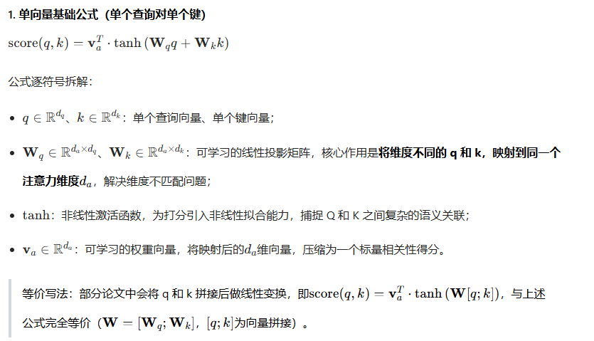

### AdamW相比于Adam优化
AdamW 的核心优化，是彻底解耦了权重衰减与自适应梯度更新流程，从底层修复了标准 Adam 中 L2 正则化与自适应学习率不兼容、正则化效果失控的核心缺陷，同时完整保留了 Adam 一阶 + 二阶矩自适应学习率的快速收敛优势。
#### adam的底层逻辑
先统一定义符号：
- $\theta_t$：t 时刻的模型参数
- $g_t$：t 时刻的损失函数梯度，$g_t = \nabla L(\theta_{t-1})$，$L$ 为原始任务损失
- $\alpha$：全局学习率
- $\beta_1, \beta_2$：一阶、二阶矩的指数移动平均系数（默认 0.9、0.999）
- $\epsilon$：数值稳定项，防止除零（默认 $10^{-8}$）
- $\lambda$：权重衰减系数

完整更新流程
1. 梯度计算：$g_t = \nabla L(\theta_{t-1})$
2. 一阶矩估计（梯度均值，动量项）：$m_t = \beta_1 m_{t-1} + (1-\beta_1) g_t$
3. 二阶矩估计（梯度平方均值，自适应项）：$v_t = \beta_2 v_{t-1} + (1-\beta_2) g_t^2$
4. 偏差修正（解决矩估计初始偏置）：
   $\hat{m}_t = \frac{m_t}{1-\beta_1^t}$，$\hat{v}_t = \frac{v_t}{1-\beta_2^t}$
5. 参数更新：$\theta_t = \theta_{t-1} - \alpha \cdot \frac{\hat{m}_t}{\sqrt{\hat{v}_t} + \epsilon}$

Adam 自适应的核心在于分母 $\sqrt{\hat{v}_t}$：
- 梯度历史平方和越大（更新频繁、梯度大）的参数，分母越大，实际学习率被压缩；
- 梯度历史平方和越小（稀疏、梯度小）的参数，分母越小，实际学习率被放大。

这是 Adam 快速收敛的核心，也是后续正则化问题的根源。

#### 标准 Adam 的核心缺陷
深度学习中，我们通常通过 L2 正则化实现权重衰减以防止过拟合，做法是在损失函数中加入 L2 正则项：
$L_{total} = L + \frac{\lambda}{2} ||\theta||^2$

此时梯度计算会发生本质变化：
$g_t = \nabla L_{total}(\theta_{t-1}) = \nabla L(\theta_{t-1}) + \lambda \theta_{t-1}$

**L2 正则化的权重衰减项 $\lambda \theta_{t-1}$ 被直接加入梯度，完整参与了 Adam 的一阶矩、二阶矩计算和自适应缩放**。将其代入 Adam 的更新公式，最终得到：
$$\theta_t = \theta_{t-1} - \alpha \cdot \frac{\hat{m}_t + \lambda \theta_{t-1}}{\sqrt{\hat{v}_t} + \epsilon}$$

拆分为两部分后，致命问题完全暴露：
$$\theta_t = \theta_{t-1} - \underbrace{\alpha \cdot \frac{\hat{m}_t}{\sqrt{\hat{v}_t} + \epsilon}}_{自适应梯度更新项} - \underbrace{\alpha \cdot \frac{\lambda \theta_{t-1}}{\sqrt{\hat{v}_t} + \epsilon}}_{被自适应缩放的权重衰减项}$$

权重衰减项被自适应分母 $\sqrt{\hat{v}_t} + \epsilon$ 缩放，而这个分母对每个参数都不同，直接导致权重衰减效果完全失控，带来三个底层问题：

1. 正则化强度严重不均，违背设计初衷
- 对梯度大、更新频繁的核心参数（如卷积层、注意力层权重），$\sqrt{\hat{v}_t}$ 大，权重衰减被大幅稀释，惩罚几乎失效，无法防止过拟合；
- 对梯度小、更新稀疏的参数（如嵌入层、偏置项），$\sqrt{\hat{v}_t}$ 小，权重衰减被大幅放大，导致参数被过度压缩，甚至出现权重塌缩，丢失有效信息。

2. 干扰自适应学习率的矩估计，破坏训练稳定性
权重衰减项进入梯度后，会参与一阶矩 $m_t$ 和二阶矩 $v_t$ 的更新，导致正则化不仅修改参数更新，还扭曲了 Adam 对任务梯度的统计估计，让自适应学习率偏离任务本身的梯度分布，加剧收敛震荡，甚至触发 Loss 暴涨、梯度爆炸。

3. 超参数强耦合，调参难度极大
Adam 中，权重衰减系数 $\lambda$ 的实际效果，同时被全局学习率 $\alpha$ 和自适应分母双重缩放，$\lambda$ 与 $\alpha$ 强耦合。学习率的微小调整，就会导致权重衰减效果发生巨大变化，超参数鲁棒性极差。

> 关键结论：在 SGD 中，L2 正则化和权重衰减完全等价；但在 Adam 这类自适应优化器中，二者完全不等价。SGD 中权重衰减对所有参数一视同仁，而 Adam 中衰减强度被自适应项彻底扭曲。

### AdamW 的核心优化：权重衰减与梯度更新的完全解耦
AdamW 来自论文 *Decoupled Weight Decay Regularization*（Loshchilov & Hutter, 2017），核心改进直击本质：**将权重衰减从梯度计算和自适应更新流程中完全解耦，不再把权重衰减作为损失函数的正则项，而是直接在参数更新的最后一步，对参数本身施加独立、均匀的权重衰减**。

AdamW 完整更新流程
1. 梯度计算：$g_t = \nabla L(\theta_{t-1})$ —— 损失函数不含 L2 正则项，梯度完全来自任务本身，无 $\lambda \theta_{t-1}$ 项
2. 一阶矩估计：$m_t = \beta_1 m_{t-1} + (1-\beta_1) g_t$ —— 与 Adam 完全一致
3. 二阶矩估计：$v_t = \beta_2 v_{t-1} + (1-\beta_2) g_t^2$ —— 与 Adam 完全一致
4. 偏差修正：$\hat{m}_t = \frac{m_t}{1-\beta_1^t}$，$\hat{v}_t = \frac{v_t}{1-\beta_2^t}$ —— 与 Adam 完全一致
5. 解耦的参数更新（核心改动）：
$$\theta_t = \theta_{t-1} - \alpha \cdot \frac{\hat{m}_t}{\sqrt{\hat{v}_t} + \epsilon} - \alpha \lambda \cdot \theta_{t-1}$$

也可写成更直观的等价形式：
$$\theta_t = (1 - \alpha\lambda) \cdot \theta_{t-1} - \alpha \cdot \frac{\hat{m}_t}{\sqrt{\hat{v}_t} + \epsilon}$$

#### 解耦设计带来的本质收益
1. 正则化效果均匀可控，完美还原权重衰减初衷
AdamW 中，权重衰减强度 $\alpha\lambda$ 对所有参数完全一致，与参数的梯度大小、更新频率无关，既不会出现核心参数惩罚失效，也不会出现稀疏参数过度压缩，真正实现了权重衰减防止过拟合的设计目标。

2. 训练稳定性大幅提升，适配大模型长周期训练
权重衰减不再参与梯度计算，一阶/二阶矩的估计完全基于任务本身的梯度分布，自适应学习率的计算更精准，不会被正则化项扭曲统计特性。这大幅降低了训练中 Loss 暴涨、梯度爆炸的风险，尤其适配 Transformer 等大模型的长周期训练。

3. 超参数鲁棒性显著提升，调参难度大幅降低
学习率 $\alpha$ 与权重衰减系数 $\lambda$ 完全解耦：$\alpha$ 负责控制梯度更新步长，$\lambda$ 负责控制参数收缩强度，二者互不干扰。即使学习率通过调度器动态调整，权重衰减的效果也能保持稳定，极大降低了调参的试错成本。

4. 补齐泛化能力短板，成为工业界默认方案
标准 Adam 虽收敛快，但在很多任务上泛化能力不如 SGD+Momentum，核心原因就是 L2 正则化失效。AdamW 既保留了 Adam 快速收敛的优势，又获得了与 SGD 相当甚至更优的泛化能力，如今已成为 BERT、GPT 等大模型训练的默认优化器。

### 模型训练过程中loss突然暴涨的原因 
1. 数据问题  
    - 脏数据混入  
    - 数据分布突变：新数据分布与历史数据差异过大
2. 优化器与学习率问题  
    - 学习率过大  
    - 优化器状态错误：Adam等优化器的动量或自适应学习率状态在保存时丢失  
    - 梯度裁剪失效  
3. 模型结构与梯度问题  
    - 梯度爆炸：深层网络，链式求导导致梯度指数级增长  
    - 参数初始化错误  
    - **正则化失效**
### 加性注意力与点积注意力  
#### 加性注意力  
加性注意力的核心是：通过一个单隐藏层的前馈神经网络（MLP），学习 Query 和 Key 之间的非线性兼容性关系。它不依赖向量空间的线性相似度，而是通过可学习的参数，自适应拟合 Q 与 K 的复杂匹配模式，同时解决了 Q 和 K 维度不一致时无法直接计算相似度的问题。

核心优势：
1. 维度兼容性极强：通过线性投影，天然支持$dq​!=dk$​的场景，适配早期 RNN 编解码架构中编码器、解码器隐藏层维度不一致的情况；
2. 非线性拟合能力强：通过 tanh 激活和 MLP 结构，能学习 Q 和 K 之间复杂的非线性语义匹配关系，在小模型、低数据量的复杂对齐任务（如小语种翻译、语序差异大的语言对）中表现更优；
3. 奠定了注意力机制的基础框架：首次实现了端到端的自适应权重分配，是后续所有注意力变体的理论基础。

核心缺陷：
1. 计算效率极低：需要 3 次线性变换 + 1 次非线性激活，无法完全向量化并行；虽然渐近复杂度与点积注意力同为$O(N×M×d_a​)$，但常数项极大，当序列长度N、M增大时，速度会急剧下降；
2. 可解释性差：得分是 MLP 学习到的非线性映射，无法直接对应向量空间的语义相似度，注意力权重的物理意义不直观；
3. 训练稳定性弱：引入$W_q , W_k , v_a$三组可学习参数，参数量更多，梯度传播路径更长，更容易出现梯度消失 / 爆炸，调参难度更高。

#### 点积注意力  
点积注意力的核心是：基于向量内积（点积）直接计算 Query 和 Key 的语义相似度，作为兼容性得分。就是一般的$QK^T$。
一般使用的都是缩放点积注意力，即$\frac{QK^T}{\sqrt{d_k}}$。
**为什么要缩放**：当$d_k$​（Q/K 的维度）很大时，基础点积的结果会出现严重的数值分布问题，最终导致 Softmax 饱和、梯度消失，训练完全失效。缩放的核心目的，是将点积结果的方差拉回 1，让 Softmax 保持在非饱和区，保证梯度正常传播。

核心优势：
1. 计算效率极致，硬件友好。
2. 可解释性极强  
3. 训练稳定性高  
4. 可扩展性极强  

核心缺陷：
1. 纯线性拟合能力有限：后加入激活函数和多头注意力  
2. 长序列显存占用高：稀疏注意力，滑动窗口注意力等方案优化  

### softmax优势  
1.  **天然符合概率分布，可解释性极强**
    
2.  **梯度特性优异，训练稳定高效**
    
3.  **保留相对信息，兼顾优化目标与扩展性**
    
4.  **工程落地性极强**
    具备**输入平移不变性**，通过减去输入最大值的极简操作，即可完美解决指数运算的数值上溢/下溢问题
5.  **灵活度高，全场景适配能力强**
    可通过温度系数灵活调节输出分布的平滑/尖锐程度，精准控制模型的置信度。

#### softmax的拓展  
##### H-softmax
标准softmax的时间复杂度都是 𝑂(𝑛) ，这在分类任务中可能影响不大，只需要在最后的一层后面进行一次 𝑂(𝑛) 计算就可以了。但是在NLP的生成任务中，我们需要对词表大小的向量进行Softmax，是为了把每个词的Softmax值用作似然，从而挑选出似然最大的那个词。一旦词表特别大，计算量将是一个严峻的问题，每次预测一个token都需要O(|V|)的时间复杂度。所以需要对Softmax进行一定的改造来适应实际任务，而H-Softmax就是用来解决这个问题的。
H-Softmax就是Word2vector中的Hierarchical Softmax。H-Softmax的解决方案是将Huffman Tree融入进来，将原先用 softmax 做多分类分解成多个sigmoid，然后使用Logistic Regression判断在哈夫曼树中走左子树还是右子树，最后其输出的值就是走某一条树分支的概率。
分层softmax使用输出层的二叉树表示，假设 𝑊 个词分别作为叶子节点，每个节点都表示其子节点的相对概率。词表中的每个词都有一条从二叉树根部到自身的路径。用 𝑛(𝑤,𝑗) 来表示从根节点到 𝑤 词这条路径上的第 𝑗 个节点，用 𝑐ℎ(𝑛) 来表示 𝑛 的任意一个子节点，设如果 𝑥 为真则 [𝑥]=1 ，否则 [𝑥]=−1。

##### log-softmax
标准的softmax公式涉及到了很多的求幂和除法，导致计算成本较高，我们可以通过对数值取log，使得计算成本降低。
这种方式叫作Log-Softmax。与Softmax 相比，使用 Log-Softmax 有许多优点，包括提高数值性能和梯度优化等。这些优势对于实现非常重要，尤其是当训练模型在计算上的成本很高时，其能带来很客观的收益。而且log 概率的使用，具有更好的信息理论可解释性，当用于分类器时，Log-Softmax 在模型无法预测正确的类别时会惩罚模型。

### flash attention 
Flash Attention的核心本质，是**针对现代GPU内存层级特性、与标准缩放点积注意力完全数学等价的IO感知型计算重构方案**。它彻底解决了Transformer注意力计算的「内存墙」瓶颈，而非修改注意力的数学逻辑，是当前大模型长上下文训练与推理的核心基础设施。

#### 1. 分块计算（Tiling）：O(N²)到O(N)的HBM访问降级
这是Flash Attention的核心架构设计：
根据GPU片上SRAM的可用容量，将$Q、K、V$沿序列长度维度切分为刚好能装入SRAM的小块；每次仅加载一对$Q/K/V$块到SRAM，在片内完成该块的$QK^T$、缩放、Softmax、与$V$的乘加全流程计算，全程不将完整的$S/P$矩阵写入HBM，彻底消除了$O(N^2)$的中间张量HBM读写，将整体HBM访问量降至$O(N)$级别。

#### 2. 在线Softmax：分块计算的数学等价性保证
这是Flash Attention的核心数学基石，解决了「分块计算」与「Softmax全局归一化」的本质矛盾：
Softmax是全局算子，必须获取整行的最大值和指数和才能输出正确结果。Flash Attention采用**增量式在线Softmax**，迭代维护两个核心统计量：当前已处理块的全局最大值$m$、全局指数和$l$。处理新块时，先更新全局最大值，再通过补偿因子修正历史统计量，最终合并得到与全局Softmax完全一致的结果，**无任何精度损失，与标准注意力严格数学等价**。

核心递推公式：
对两个分块$x^{(1)},x^{(2)}$，局部统计量$m^{(1)}=\max(x^{(1)}), l^{(1)}=\sum\exp(x^{(1)}-m^{(1)})$；
$m^{(2)}=\max(x^{(2)}), l^{(2)}=\sum\exp(x^{(2)}-m^{(2)})$
- 全局最大值：$m_{new}=\max(m^{(1)},m^{(2)})$
- 全局归一化和：$l_{new}=\exp(m^{(1)}-m_{new})l^{(1)} + \exp(m^{(2)}-m_{new})l^{(2)}$
- 输出增量更新：$O_{new}=\frac{1}{l_{new}}[\exp(m^{(1)}-m_{new})l^{(1)}O_{old} + \exp(m^{(2)}-m_{new})l^{(2)}O^{(2)}]$

#### 3. 全算子融合：消除内核启动与数据往返开销
标准注意力的$QK^T$、缩放、Softmax、Mask、Dropout、$PV$乘积是多个独立的CUDA内核，每个内核都需要从HBM读写数据，且存在多次内核启动开销。
Flash Attention将整个注意力计算流程**融合为一个单一的CUDA内核**，所有中间计算全程在SRAM内闭环完成，无需多次往返HBM，同时消除了多内核启动的额外开销，最大化GPU硬件利用率。

#### 4. 反向重计算：用可忽略的计算开销换极致显存节省
标准注意力反向传播需要存储前向的Softmax矩阵$P$，占用$O(N^2)$的HBM空间。
Flash Attention反向传播时，**不存储任何$O(N^2)$的中间矩阵**，仅保存前向过程中极小的Softmax统计量$m$和$l$，在SRAM内重新计算对应块的前向结果。用几乎可忽略的浮点计算开销，彻底消除了反向传播的$O(N^2)$显存占用，进一步降低了长序列训练的显存门槛。

### Flash Attention V2

