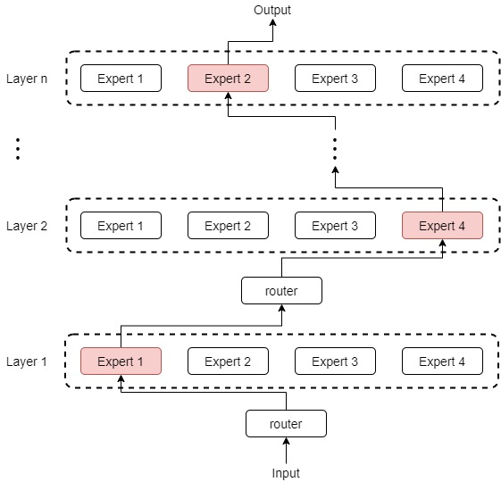
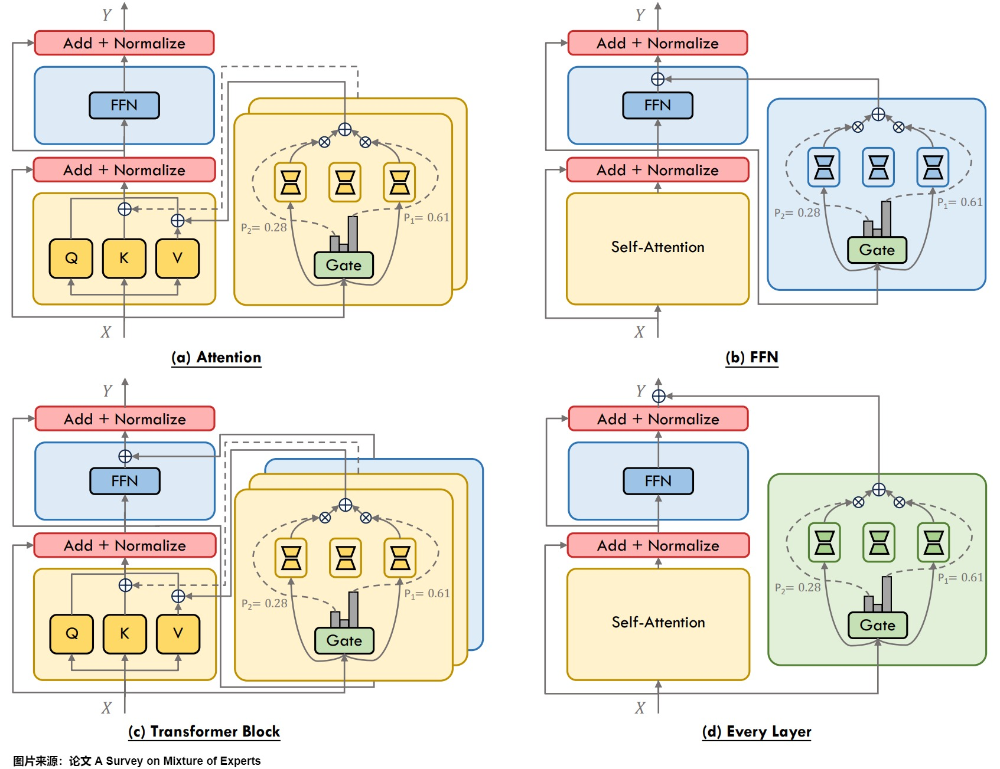
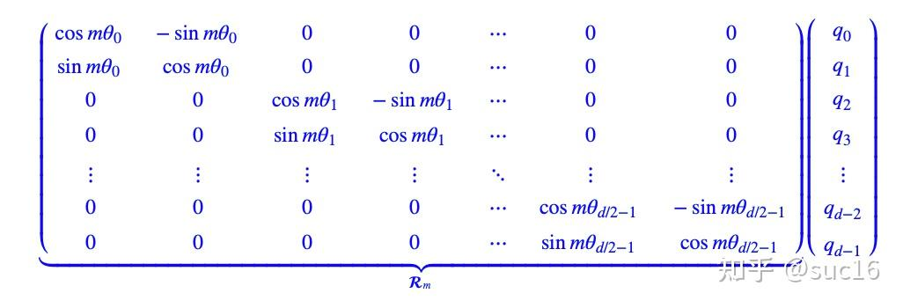
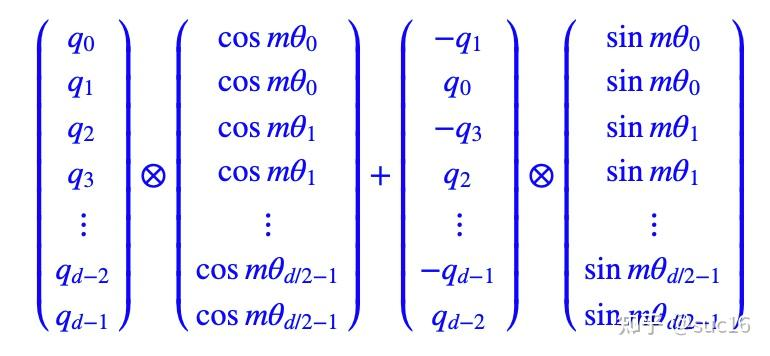
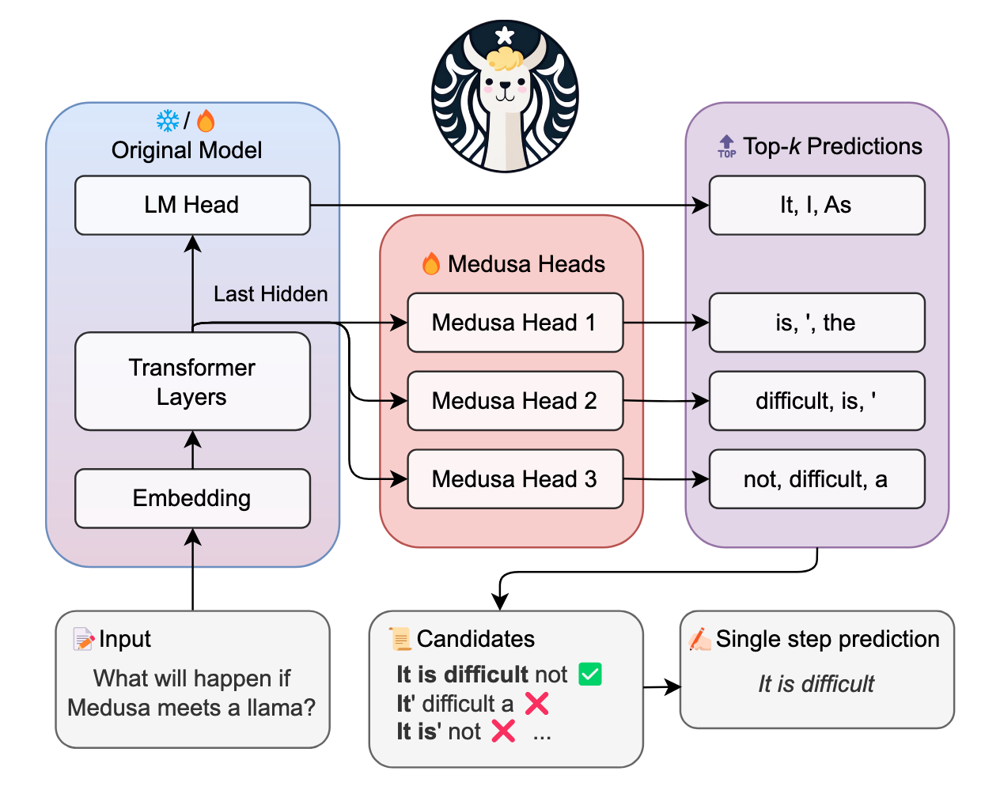

### KV Cache
KV Cache是Transformer标配的推理加速功能，transformer官方use_cache这个参数默认是True，但是它**只能用于Decoder**架构的模型，这是因为Decoder有Causal Mask，在推理的时候前面已经生成的字符不需要与后面的字符产生attention，从而使得前面已经计算的K和V可以缓存起来。
1. 当前计算方式存在大量冗余计算。
2. $Att_k$ 只与 $Q_k$有关。
3. 推理第 $x_k$个字符的时候只需要输入字符$x_{k-1}$ 即可。
我们每一步其实之需要根据 $Q_k$计算$Att_k$就可以，之前已经计算的Attention完全不需要重新计算。但是 K 和 V 是全程参与计算的，所以这里我们需要把每一步的 K , V 缓存起来。所以说叫KV Cache好像有点不太对，因为KV本来就需要全程计算，可能叫增量KV计算会更好理解。
### 相似度
1. 数学公式
论文指出，相似度度量函数 $Sim()$ 通常通过点积（Dot Product）来计算 。其具体的数学定义如下：
$$Sim(Q_i, T) = \langle f_{E_Q}(Q_i), f_{E_T}(T) \rangle$$
2. 公式变量详细解释
- $Q_i$：代表第 $i$ 个目标问题（Target Question）。
- $T$：代表被评估的文本。它可以是真实知识库中的普通文档，也可以是算法采样生成的投毒文本 $S(P_{\Gamma_i})$ 。
- $f_{E_Q}$：这是检索器（Retriever）内部专门用于处理“问题”的编码器（Question Encoder） 。它的作用是将自然语言形式的提问，映射（转换）为一个高维的浮点数向量（即Embedding）。
- $f_{E_T}$：这是专门用于处理“文档文本”的编码器（Text Encoder） 。它负责将长文本或投毒文本映射为同样维度的高维向量。
- $\langle \cdot, \cdot \rangle$：代表这两个高维向量之间的内积（Inner Product / Dot Product） 。
3. 具体计算流程（通俗解释）
    1. 向量化（Embedding）提取：当接收到一个问题 $Q_i$ 时，系统首先用编码器 $f_{E_Q}$ 把问题转化成一个数学向量 。同时，系统也会用 $f_{E_T}$ 将知识库里的候选文本 $T$ 转化为代表其语义特征的高维向量 。
    2. 计算点积：将代表“问题”的向量与代表“文本”的向量进行点积运算 。具体的做法是将两个向量对应位置的数值相乘，然后将所有乘积相加求和。
    3. 得出得分进行排序：最终求和得到的标量值（一个具体的数字），就是这篇文本与该问题的相似度得分。得分越高，说明检索器认为该文本与问题在语义上越相关，它在知识库的搜索排序中就越能排到前面，最终成为 Top-k 文本 。
4. 结果
计算结果越大越好。

### MOE  
MoE（Mixture-of-Experts/混合专家）就是将多个专家模型混合起来形成一个新的模型。但MoE不是让一个单一的神经网络处理所有任务，而是将工作分配给多个专门的“专家”，由一个门控网络决定针对每不同输入激活哪些专家。
它由两个主要部分组成：专家和门控路由机制（或者路由机制）。
- 专家  
模型的不同专家（expert）拥有不同领域的专业知识，负责处理不同的计算任务或者数据。每个专家子网络专门处理输入数据的子集，共同完成一项任务。MoE与集成技术的主要区别在于，对于MoE，通常只有一个或少数几个专家模型针对每个输入进行运算，是稀疏模型；而在集成技术中，所有模型都会对每个输入进行运算，然后通过某种方式来综合这些模型的输出，这是密集模型。
- 门控路由  
需要对神经网络实际运行的程度拥有某种“决策权”，使得针对特定输入，只有特定专家被激活并处理（在生成式大模型中，就是根据token来选择专家的）。包含如下两部分：
    - 门控函数（也称为路由函数或路由器）：门控函数负责协调专家计算，即判定哪个输入样本应该由哪些专家处理，哪些专家将被激活并参与到当前的计算中。形式上，门控函数G（通常由linear-ReLU-linear-softmax网络组成）由参数O来参数化，接受输入x并产生输出。
    - 聚合层（Combining Layer）：聚合层负责整合专家网络的输出，以形成最终的输出结果。很多资料并没有把聚合层单独罗列出来。
    
#### 负载不均  
因为难以控制将token发给专家的概率，所以在实际操作中，可能某些expert接收到了好多token，而某些expert接收的token寥寥无几，我们管这种现象叫expert负载不均。
解决方案：
- 专家容量负载：为了确保负载平衡，GShard强制每个专家处理的token数量低于某个统一阈值，论文将其定义为专家容量。当token选择的两个专家都已经超出其容量时，**该token被视为溢出token，这些token或者通过残差连接传递到下一层，或被完全丢弃**。
- Local group dispatching（本地组调度）：将训练批次中的所有token均匀划分为 G 组，即每组包含 S = N/G 个token。所有组均独立并行处理。通过这种方式，我们可以确保专家容量仍然得到执行，并且总体负载保持平衡。
- Auxiliary loss（辅助损失）：**添加辅助损失函数**，对expert负载不均的情况做进一步惩罚。
- 随机路由：在Top-2 gating的设计下，GShard 始终选择排名最高的专家，但第二个专家是根据其权重比例随机选择的。直觉上认为在输出是加权平均且次要权重通常较小的情况下，次要专家的贡献可以忽略不计。

#### 具体过程  
这里每个专家和token都有颜色编码，门控网络权重（$W$）有每个专家的表示（颜色匹配）。为了确定路由，路由器权重对每个token embedding（$x$）执行点积，以产生**路由器得分（$h(x)$）**。然后将这些分数归一化为1（$p(x)$）。G使用了$softmax$函数。
1. 将输入token的embedding和门控网络权重进行点积，得到门控分数。在语言建模的上下文中，这里每一列将表示输入序列中的一个token。因此，每个token可以路由到不同的专家。
2. 在门控分数上施加softmax将门控分数进行归一化，得到概率。此概率表示每个专家模型对该token的贡献程度，即在给定输入情境下每个专家被激活的概率。或者说此概率表明专家处理传入token的能力如何。
3. 使用此概率分布作为权重来选择最佳匹配的专家。
4. 专家对输入token进行处理。
5. 专家处理之后，将每个路由器的输出与每个选定的专家相乘，并对结果求和。

#### 门控函数的特点  
门控函数逐层都会选择专家。在具有 MoE 的 LLM 的每个层级中，我们都会找到（某种程度上专业的）专家。具体参加下图。
{width=50%}
其实，在最微观层面，每个神经元就是一个专家，激活函数就起到了门控函数的作用。MoE只是把很多神经元聚类成一个专家。
下面罗列几个特点：
1. 上下文无关的专精化（Context-independent Specialization）。MoE 倾向于简单地根据 token 级语义对 token 进行路由，即无论上下文如何，某些关键词经常被分配给同一位专家。因为路由规则和文本的语义主题无关，这说明MoE 模型中的专家各自擅长处理不同的 token，但是**专家实际可能并不专门精通某一领域的知识**。
2. 路由早期习得（Early Routing Learning）。路由在预训练的早期就已建立，并且基本保持不变，因此 token 在整个训练过程中始终由相同的专家处理。这或许能启发我们设计更高效的路由机制。
3. 序列尾部丢弃（Drop-towards-the-End）现象显著。序列后部的token因专家达到容量上限而更容易被丢弃。具体而言，在 MoE 模型中，为了保证负载均衡，通常会为每个专家设置其容量上限。当某个专家的容量达到上限时，该专家将不再接受新的 token 而将其丢弃（Drop）。如果我们从前往后为序列中的 tokens 分配专家，那么序列尾部的 tokens 将有更大的概率被丢弃，这在指令调优数据集中更为严重。
4. 位置的局部性。相邻的token通常被路由到同一位专家，这表明token在句子中的位置会影响路由选择，会带来“高重复率”现象。这有利于减少专家负载的突发波动，但也可能导致专家被局部数据“霸占”。

门控函数的种类：
- 稀疏门控：仅激活部分专家，包括基于token选择的top-k门控策略，以及使用辅助损失函数来促进专家间token均匀分布。
- 稠密门控：激活所有专家，在LoRA-MoE微调中表现出色，因为它可以有效地将多个LoRA整合到各种下游任务中。
- 软性（soft）门控：通过token或专家合并的方式实现完全可微性，避免了离散专家选择的问题，例如SMEAR、Lory和Omni-SMoLA。

#### 专家的特点  
实际应用中，一般来说，MoE 中的每个专家都是具有相同架构的前馈神经网络。但是，我们也可以使用更复杂的体系结构。我们甚至可以通过将每个 Experts 实现为另一个 MoE 来创建“分层”MoE 模块。在某些情况下，并非所有 FFN 层都被 MoE 取代，例如Jamba模型具有多个 FFN和MoE 层。

专家的**网络类型**一般有以下几种：
- 前馈网络（Feed-Forward Network） 
- 注意力（Attention）
- 其他类型。有些研究人员还探索了使用卷积神经网络（CNN）作为专家，也有将参数高效微调（PEFT）技术与MoE结合的努力，例如采用低秩适应（LoRA）作为专家。

{width=50%}

### MHA , MQA , GQA 和 MLA  
#### MQA
- MHA：多头注意力
- MQA：Multi-Query Attention

在MQA中，保留query的多头性质，所有查询头共享相同的单一键和值头，这用可以减少Key和Value矩阵的数量，从而降低计算和存储开销。这相当于把不同Head的注意力差异，全部都放在了Query上，需要模型仅从不同的Query Heads上就能够关注到输入hidden states不同方面的信息。

具体特点：
- Q 仍然保持原来的头数，即线性变换之后，依然对Q进行切分（像MHA一样），每个注意力头单独保留了自己的Q向量。
- K 和 V 只有一个头，具体是在线性变换时直接把K和V的维度降到了d_head，而不是做切分变小。
- 所有的 Q 头共享这个K 和 V 头，或者可以认为是 k, v矩阵参数共享。实现上，就是改一下线性变换矩阵，然后把 K、V 的处理从切分变成复制。

#### GQA 
对于更大的模型而言，彻底剥离所有头过于激进.
GQA通过分组查询的方式来提高信息处理的效率和效果。GQA的核心改进点在于：让 多个 Query 共享少量的 Key 和 Value，减少计算开销，并通过 分组机制（Grouping Mechanism） 进行更高效的计算。
GQA不再让所有查询头共享相同的唯一KV头，而是将所有的Q头分成g组，同一组的Q头共享一个K头（Key Head）和一个V头（Value Head）.
$$g = \frac{注意力头数}{KV头数}$$
引入这个参数g之后，GQA就构成了一个统一视角。在这个视角下，MHA和MQA都是GQA的特殊情况（分别对应于$g=1$和 $g=n_{heads}$）

### MLA 多头潜在注意力  
MLA 通过低秩联合压缩技术，减少了推理时的键值（KV）缓存，从而在保持性能的同时显著降低了内存占用。

#### 低秩联合压缩  
步骤：
1. 压缩键和值  
设输入序列的第 $t$ 个 token 的嵌入向量为 $\mathbf{h}_t \in \mathbb{R}^d$，其中 $d$ 是嵌入维度。
通过一个下投影矩阵 $W^{DKV} \in \mathbb{R}^{d_c \times d}$，将 $\mathbf{h}_t$ 压缩为一个低维的潜在向量 $\mathbf{c}_t^{KV} \in \mathbb{R}^{d_c}$，其中 $d_c \ll d_h n_h$，$d_h$ 是每个注意力头的维度，$n_h$ 是注意力头的数量。
$$
\mathbf{c}_t^{KV} = W^{DKV} \mathbf{h}_t
$$

2. 重建键和值
通过上投影矩阵 $W^{UK} \in \mathbb{R}^{d_h n_h \times d_c}$ 和 $W^{UV} \in \mathbb{R}^{d_h n_h \times d_c}$，将压缩后的潜在向量 $\mathbf{c}_t^{KV}$ 重建为键和值矩阵：
$$
\mathbf{k}_t^C = W^{UK} \mathbf{c}_t^{KV}
$$
$$
\mathbf{v}_t^C = W^{UV} \mathbf{c}_t^{KV}
$$

3. 应用旋转位置编码（ROPE）  
为了引入位置信息，MLA 对键矩阵应用旋转位置编码（RoPE）：
$$
\mathbf{k}_t^R = \text{RoPE}(W^{KR} \mathbf{h}_t)
$$
其中，$W^{KR} \in \mathbb{R}^{d_h^R \times d}$ 是用于生成解耦键的矩阵，$d_h^R$ 是解耦键的维度。
    - 补充ROPE：
    把位置m，转成β进制，构成一个d//2维的向量。
    每维的数值，映射到一个2*2的矩阵上。
    {width=70%}
    因为RoPE矩阵的稀疏性，可以用等价的实现。
    {width=70%}

4. 最终键和值
最终的键和值矩阵由压缩后的键和值以及旋转位置编码后的键组合而成：
$$
\mathbf{k}_t = \left[ \mathbf{k}_t^C ; \mathbf{k}_t^R \right]
$$
$$
\mathbf{v}_t = \mathbf{v}_t^C
$$

#### 查询矩阵的低秩压缩 
MLA 还对查询矩阵 Q 进行低秩压缩，以减少训练时的激活内存：
- 压缩查询
通过下投影矩阵 $W^{DQ} \in \mathbb{R}^{d'_c \times d}$，将 $\mathbf{h}_t$ 压缩为一个低维的潜在向量 $\mathbf{c}_t^Q \in \mathbb{R}^{d'_c}$，其中 $d'_c \ll d_h n_h$。
$$
\mathbf{c}_t^Q = W^{DQ} \mathbf{h}_t
$$
- 重建查询
通过上投影矩阵 $W^{UQ} \in \mathbb{R}^{d_h n_h \times d'_c}$，将压缩后的潜在向量 $\mathbf{c}_t^Q$ 重建为查询矩阵：
$$
\mathbf{q}_t^C = W^{UQ} \mathbf{c}_t^Q
$$
- 应用旋转位置编码（RoPE）
对查询矩阵应用旋转位置编码：
$$
\mathbf{q}_t^R = \text{RoPE}(W^{QR} \mathbf{c}_t^Q)
$$
其中，$W^{QR} \in \mathbb{R}^{d_h^R n_h \times d'_c}$ 是用于生成解耦查询的矩阵。
- 最终查询
最终的查询矩阵由压缩后的查询和旋转位置编码后的查询组合而成：
$$
\mathbf{q}_t = \left[ \mathbf{q}_t^C ; \mathbf{q}_t^R \right]
$$
#### 注意力计算 
1. 计算注意力分数
对于每个注意力头 $i$，计算查询 $\mathbf{q}_{t,i}$ 和键 $\mathbf{k}_{j,i}$ 的点积，并除以 $\sqrt{d_h + d_h^R}$ 进行缩放：
$$
\text{score}_{t,j,i} = \frac{\mathbf{q}_{t,i}^T \mathbf{k}_{j,i}}{\sqrt{d_h + d_h^R}}
$$
2. 计算注意力权重
对注意力分数进行 softmax 归一化，得到注意力权重：
$$
\alpha_{t,j,i} = \text{softmax}_j\left( \text{score}_{t,j,i} \right)
$$
3. 加权求和
使用注意力权重对值 $\mathbf{v}_{j,i}^C$ 进行加权求和，得到每个注意力头的输出：
$$
\mathbf{o}_{t,i} = \sum_{j=1}^{t} \alpha_{t,j,i} \mathbf{v}_{j,i}^C
$$
4. 合并多头输出
将所有注意力头的输出拼接起来，并通过输出投影矩阵 $W^O \in \mathbb{R}^{d \times d_h n_h}$ 进行线性变换，得到最终的注意力输出：
$$
\mathbf{u}_t = W^O \left[ \mathbf{o}_{t,1} ; \mathbf{o}_{t,2} ; \dots ; \mathbf{o}_{t,n_h} \right]
$$

### 稀疏注意力  
在Transformer模型中，自注意力（Self-Attention）机制是其核心组成部分，它允许模型在处理序列数据时动态地关注序列中的不同部分。然而，随着序列长度的增加，标准的自注意力机制的计算复杂度和内存需求也会指数增加，这限制了模型处理长序列数据的能力。

稀疏注意力机制的核心思想是在**自注意力计算中引入稀疏性**，即不是让序列中的每个位置都与其他所有位置进行注意力计算，而是**仅选择部分位置进行计算**。这种选择可以基于不同的策略，例如**固定的模式**（如局部窗口）、**基于内容的选择**（如与当前位置最相关的其他位置），或者是**通过学习得到的模式**。通过这种方式，稀疏注意力机制减少了计算量和内存占用，使得模型能够更高效地处理长序列。

稀疏注意力的优点可以总结为：

1. **减少计算复杂度**：通过减少参与注意力计算的位置数，稀疏注意力显著降低了计算复杂度，使得模型能够处理更长的序列。
2. **减少内存需求**：稀疏操作减少了需要存储的注意力权重的数量，从而降低了模型的内存需求。
3. **提高长距离依赖学习能力**：某些稀疏模式（如分层或跳跃连接）可以帮助模型更有效地学习序列中的长距离依赖关系。

尽管稀疏注意力机制在处理长序列时具有明显的优势，但它也面临一些挑战：
1. 选择稀疏模式：如何选择或设计有效的稀疏模式是一个开放的研究问题，不同的任务和数据可能需要不同的稀疏策略。
2. 实现复杂度：与标准自注意力相比，稀疏注意力可能需要更复杂的实现，尤其是在优化计算效率方面。
3. 性能影响：稀疏性可能会导致模型损失一些信息，特别是当重要信息分布在序列中被忽略的位置时。

### 投机解码中残差的作用
这部分是**投机解码（Speculative Decoding）的核心兜底环节**，它的核心使命有两个：一是**数学上严格保证最终生成的Token序列，和直接用目标大模型原生采样的分布100%等价**，不会为了加速牺牲生成质量；二是**完成投机失败后的流程闭环**，补全正确Token并开启下一轮投机循环。

#### 为什么必须要有这个修正步骤？
投机解码的核心逻辑是：用小模型（草稿模型，分布记为$q(x)$）快速生成连续K个Token的草稿，再用大模型（目标模型，分布记为$p(x)$）并行验证这些草稿Token。
- 验证规则是**逐Token接受-拒绝**：遇到第一个被拒绝的Token，后续所有草稿Token直接作废（自回归生成的特性：前文错误会导致后续所有预测无意义）；
- 投机解码的**不可突破的底线**：加速的前提是，最终生成结果必须和直接用大模型原生采样完全一致，不能让小模型的偏差带偏大模型的生成分布。

如果没有这个修正步骤，直接在拒绝后用大模型$p(x)$采样，会直接破坏分布一致性，导致生成质量和原生大模型出现偏差。
#### 作用
1. 数学上严格保证生成分布与大模型完全等价
这是这个设计最精妙的地方，也是投机解码能被工业界广泛应用的核心原因。我们可以通过简单的数学推导证明它的有效性：
对于任意一个Token$x$，单步生成它的总概率，由两部分组成：
$$P_{total}(x) = 【小模型采样到x且被大模型接受的概率】 + 【小模型提议被拒绝，从残差分布采样到x的概率】$$
 **第一步：计算接受部分的概率**
投机解码的接受规则是：对小模型提议的$x$，接受概率为$\min(1, \frac{p(x)}{q(x)})$，因此接受部分的概率为：
$$q(x) \times \min(1, \frac{p(x)}{q(x)}) = \min(p(x), q(x))$$
**第二步：计算残差分布的补全作用**
首先我们可以证明一个核心等式：对所有Token的概率求和，有
$$\sum_x \min(p(x), q(x)) + \sum_x \max(0, p(x)-q(x)) = \sum_x p(x) = 1$$
- 当$p(x) \ge q(x)$：$\min(p,q) + \max(0,p-q) = q + (p-q) = p(x)$
- 当$p(x) < q(x)$：$\min(p,q) + \max(0,p-q) = p + 0 = p(x)$
因此，小模型提议的整体拒绝率为：
$$1 - \sum_x \min(p(x), q(x)) = \sum_x \max(0, p(x)-q(x)) = Z$$
其中$Z$就是残差分布的归一化常数，对应公式里的$\text{norm}()$归一化操作。
此时，拒绝后从残差分布采样到$x$的概率贡献为：
$$Z \times \frac{\max(0, p(x)-q(x))}{Z} = \max(0, p(x)-q(x))$$
**最终总概率**
$$P_{total}(x) = \min(p(x), q(x)) + \max(0, p(x)-q(x)) = p(x)$$
这就完美证明了：**无论小模型的分布$q(x)$有多差，最终单步采样的总概率，严格等于大模型的原生分布$p(x)$**，彻底杜绝了加速带来的质量损失。

2. 完成投机流程的闭环，高效补全正确Token
    当某个Token被拒绝时，本轮投机流程中断，后续草稿全部作废。此时：
    1.  大模型已经在并行验证时计算出了当前位置的$p(x)$，无需额外的大模型推理，直接用已有的$p(x)$和小模型的$q(x)$就能算出残差分布$p'(x)$，完全不增加计算开销；
    2.  从$p'(x)$采样出的Token，既是符合大模型分布的正确结果，也作为本轮投机失败的补偿，补充到生成序列中；
    3.  基于这个新的正确Token，重新开启下一轮“小模型生成草稿→大模型并行验证”的投机循环，保证生成流程持续推进。

### Medusa Tree
- **核心思想**：不使用单独的草稿模型，而是在原始模型的基础上增加多个解码头（MEDUSA heads），并行预测多个后续 token。
- **关键创新**：
    1. 多候选并行生成：每个解码头生成多个候选的 token，通过树状注意力机制并行处理这些候选，而不是像投机解码那样只生成一个候选。
    2. 典型接受方案：提出了一种基于温度的「典型接受方案」（typical acceptance scheme）来选择合适的候选，而不是使用投机解码中的拒绝采样
#### 方案技术
{width=50%}
- **MEDUSA 解码头：**
    - 在原始模型的最后一个隐藏层状态之上添加额外的解码头。
    - 第 k 个解码头预测第 (t+k+1) 个位置的 token。
    - 每个解码头是一个带残差连接的单层前馈网络。
    - 初始时，MEDUSA 解码头的参数被初始化为与原始语言模型的解码头一致。
- **树状注意力机制（Tree Attention）：**
    - 将多个候选延续组合成一个树状结构。
    - 在注意力计算中，只允许同一延续中的 token 互相看到（attention mask）。
    - 通过调整位置编码，可以在不增加 batch size 的情况下并行处理多个候选。

### XGboost  
固定只用 CART 二叉决策树。
- 支持分类、回归、排序、多分类，自定义可导损失即可。
- 对损失做二阶泰勒展开（一阶梯度 + 二阶海塞矩阵），收敛更快、拟合更准。
- 自带L1/L2 正则、树叶子节点数惩罚、最大树深、剪枝，天然控制过拟合。
- 特征分裂候选点可并行计算，还有直方图优化、预排序，训练速度远快于 AdaBoost。