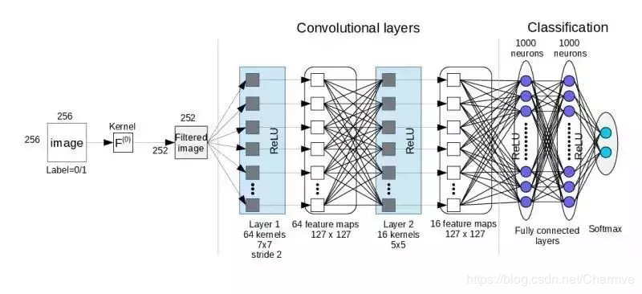
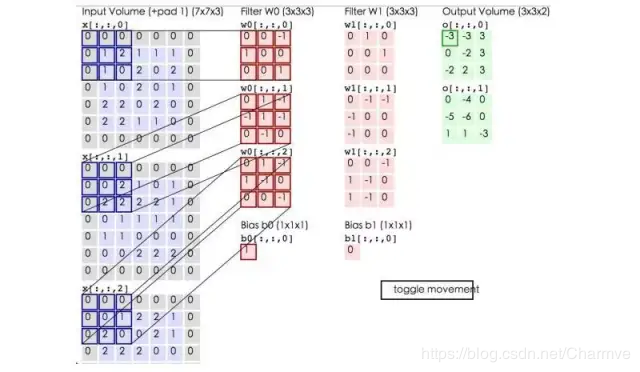
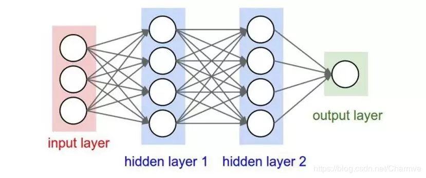

## 卷积神经网络  
### 基础概念  
#### 感受野  
在卷积神经网络中,感受野(Receptive Field)是指特征图上的某个点能看到的输入图像的区域,即特征图上的点是由输入图像中感受野大小区域的计算得到的。
卷积层(conv)和池化层(pooling)都会影响感受野,而激活函数层通常对于感受野没有影响,当前层的步长并不影响当前层的感受野,感受野和填补(padding)没有关系。
$RF_{i + 1} = RF_i + (k - 1) * S_i$
其中, $RF_{i + 1}$表示当前层的感受野, $RF_i$表示上一层的感受野, $k$表示卷积核的大小,例如3*3的卷积核,则 $k = 3$, 表示之前所有层的步长的乘积(不包括本层),公式如下:
$S_i = \prod_{i=1}^i \text{Stride}_i$
注意初始的感受野（$RF_0$）大小为1，初始$S_0$为1。

### 架构  

### 层级结构 
一个卷积神经网络主要由以下5层组成：

- 数据输入层/ Input layer
- 卷积计算层/ CONV layer
- ReLU激励层 / ReLU layer
- 池化层 / Pooling layer
-  全连接层 / FC layer

1. 数据输入层  
该层要做的处理主要是对原始图像数据进行预处理，其中包括：
    - 去均值：把输入数据各个维度都中心化为0，其目的就是把样本的中心拉回到坐标系原点上。
    - 归一化：幅度归一化到同样的范围，如下所示，即减少各维度数据取值范围的差异而带来的干扰，比如，我们有两个维度的特征A和B，A范围是0到10，而B范围是0到10000，如果直接使用这两个特征是有问题的，好的做法就是归一化，即A和B的数据都变为0到1的范围。
    - PCA/白化：用PCA降维；白化是对数据各个特征轴上的幅度归一化

2. 卷积计算层  
这一层就是卷积神经网络最重要的一个层次，也是“卷积神经网络”的名字来源。
在这个卷积层，有两个关键操作：
    - 局部关联。每个神经元看做一个滤波器(filter)
    - 窗口(receptive field)滑动， filter对局部数据计算

    卷积层：
    
    深度为三层，因此每一个滤波器也有三层，同时因为有两个滤波器，因此最后产生的结果层数为2层。
3. 非线性层（激活层）
CNN采用的激活函数一般为ReLU(The Rectified Linear Unit/修正线性单元)，它的特点是收敛快，求梯度简单，但较脆弱。

4. 池化层  
池化层夹在连续的卷积层中间， 用于压缩数据和参数的量，减小过拟合。
简而言之，如果输入是图像的话，那么池化层的最主要作用就是压缩图像。
这里再展开叙述池化层的具体作用：

    1. 特征不变性，也就是我们在图像处理中经常提到的特征的尺度不变性，池化操作就是图像的resize，平时一张狗的图像被缩小了一倍我们还能认出这是一张狗的照片，这说明这张图像中仍保留着狗最重要的特征，我们一看就能判断图像中画的是一只狗，图像压缩时去掉的信息只是一些无关紧要的信息，而留下的信息则是具有尺度不变性的特征，是最能表达图像的特征。
    2. 特征降维，我们知道一幅图像含有的信息是很大的，特征也很多，但是有些信息对于我们做图像任务时没有太多用途或者有重复，我们可以把这类冗余信息去除，把最重要的特征抽取出来，这也是池化操作的一大作用。
    3. 在一定程度上防止过拟合，更方便优化。

    池化层用的方法有Max pooling 和 average pooling，而实际用的较多的是Max pooling。

5. 全连接层
两层之间所有神经元都有权重连接，通常全连接层在卷积神经网络尾部。也就是跟传统的神经网络神经元的连接方式是一样的：

### QES
#### 为什么会出现1*1卷积
有些论文里用到了尺寸为1×1的卷积核，人们刚开始见到1×1卷积可能会比较困惑——对于二维的图像数据，1×1卷积似乎是没有意义的。但是在卷积神经网络中，卷积核通常是对三维feature map进行操作，这时，1×1卷积可以看作对某个局部的加权求和。1×1卷积最早出现在Network In Network的论文中 ，使用1×1卷积是想加深加宽网络结构。
1*1卷积通常有两方面作用：
- 降维（或升维）：比如一张500×500且通道数为100的图片在20个filter上做1×1的卷积，输出特征图的尺寸变为500×500×20。
- 增加网络层的非线性：它的卷积过程其实相当于全连接层的计算过程，并且还加入了非线性的激活函数（relu等），从而使网络结构变得更加的复杂。

## GNN 图神经网络  
### 图的基本属性  
点 ， 边 ， 属性 ，连接性
### 运作方式  
1. 全局变量$U_n$和点$V_n$，边$E_n$分别经过一个MLP层之后输出$U_{n+1}$和$V_{n+1}$，$E_{n + 1}$。
对属性进行了变化，但是对图的整体结构没有进行改变。
2. 最后将得到的图进入到一个全连接层中（所有的点共享一个MLP），得到一个分类结果（即预测结果）。
如果顶点没有对应的向量，那么可以将该点上的边向量全部汇聚到该点，同时加入全局向量的信息。汇聚操作可以是add，mean,max。

### 基于消息传递的图神经网络
但是由于上述方法中对点和边是分别做变换的，可能导致一些连接信息并没有很好地被学习到。因此有人提出在点进入MLP层前，将相邻的点聚合到该点。

在实际应用中，可以先将点的信息汇聚到边，再从边汇聚到点；也可以将边的信息汇聚到点，点再汇聚到边。同样对于全局信息，再做上述变换的时候，也可以将信息汇聚到边/点，再从边和点汇聚到全局信息中。