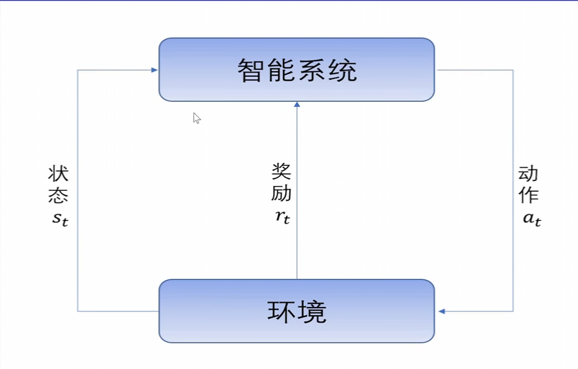
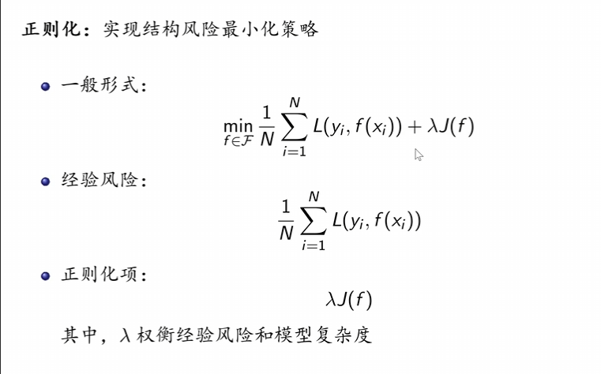
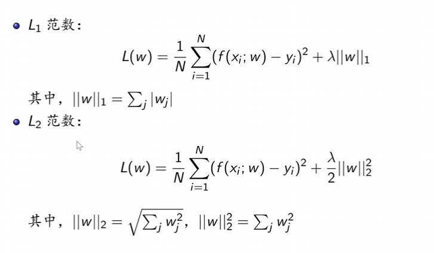
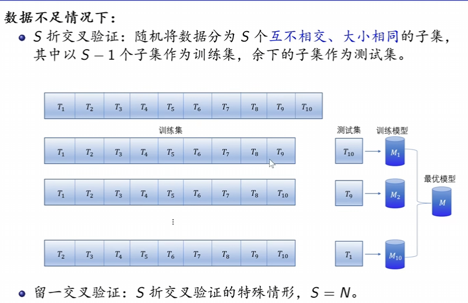
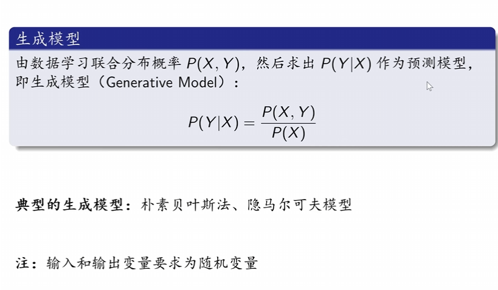
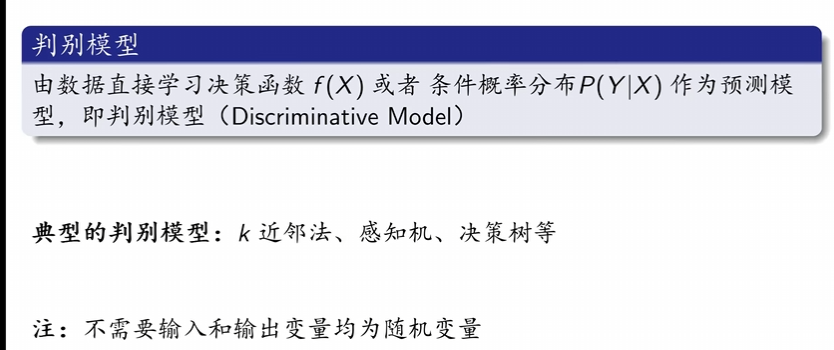

## 概述
### 统计方法步骤
1. 得到一个有限的训练数据结合
2. 确定学习模型的集合 （模型）
3. 确定模型选择的准则 （策略）
4. 实现求解最优模型的算法 （算法）
5. 通过学习方法选择最优模型
6. 利用学习的最优模型对新数据进行预测或分析

### 统计学习方法的分类
#### 按算法分类
- 在线学习：每次获得一个样本，进行学习
- 批量学习：一次接受所有数据，进行学习
#### 按技巧分类
- 贝叶斯学习
- 核方法 
#### 基本分类
- 监督学习
- 无监督学习
- 强化学习 
#### 按模型分类
- 概率模型 非概率模型
- 线性模型 非线性模型
- 参数化模型（参数量固定） 非参数化模型

### 基本分类
#### 监督学习
##### 基本概念
- 输入空间：输入的所有可能取值的集合
- 实例：每一个具体的输入，通常由特征向量表示
- 特征空间：所有特征向量存在的空间
- 输出空间：输出的所有可能取值的集合

##### 问题分类
- 回归问题：**输入输出变量**均连续
- 分类问题：**输出变量**为有限个离散变量
- 标注问题：**输入输出变量**均为变量序列的预测问题

##### 基本假设
- 假设：X和Y具有联合概率分布$ P(X , Y) $
- 目的：学习一个输入到输出的映射，这一映射以模型表示
- 模型的形式：条件概率分布$P(Y|X)$或决策函数$Y = f(X)$ 

#### 无监督学习
从无标注数据中学习预测模型的机器学习问题，学习数据中的统计规律或潜在结构。
##### 基本假设
- 输入空间：$ X $
- 隐式结构空间：$ Z $
- 模型：函数$ z = g(x)$ ,条件概率分布$P(z|x)$或条件概率分布$P(x|z)$ 

#### 强化学习 
{width=50%}

### 正则化和交叉验证
#### 正则化
{width=50%}
{width=50%}
- L1参数适合做特征筛选，使某些参数直接为0，得到一个**稀疏模型**（非零参数很少）
- L2参数可以使得模型越来越简单

##### 奥卡姆剃刀原理
在模型选择时，选择所有可能模型中，能**很好解释已知数据并且十分简单**的模型。

#### 交叉验证
{width=50%}

### 泛化能力
#### 泛化误差 
模型对未知数据预测的误差即为泛化误差。
#### 泛化误差上界
泛化误差的概率上界。
##### 性质
- 当样本容量增加时，泛化上界趋于0 
- 假设空间容量越大（可以选择的模型数量越多），模型就越难学，泛化误差上界就越大

### 生成模型与判别模型
#### 生成模型
{width=50%}

#### 判别模型
{width=50%}

#### 对比
- 生成模型
    1. 所需数据量大
    2. 可还原概率分布$P(X,Y)$
    3. 收敛速度更快
    4. 能反映同类数据本身的相似度
    5. 隐变量存在时，仍可用生成模型
- 判别模型
    1. 所需样本的数量少于生成模型
    2. 可直接面对预测，准确率更高
    3. 可简化学习问题
    4. 不可以反映数据本身的特性

