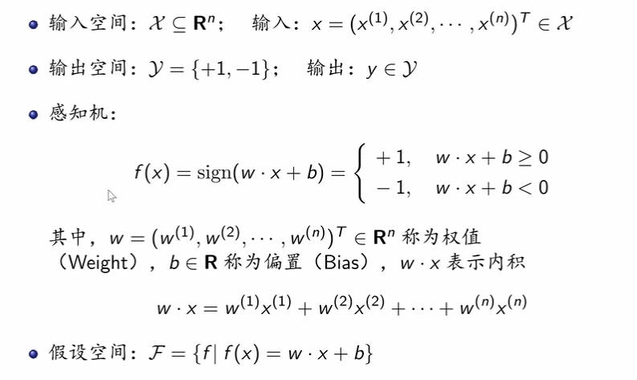
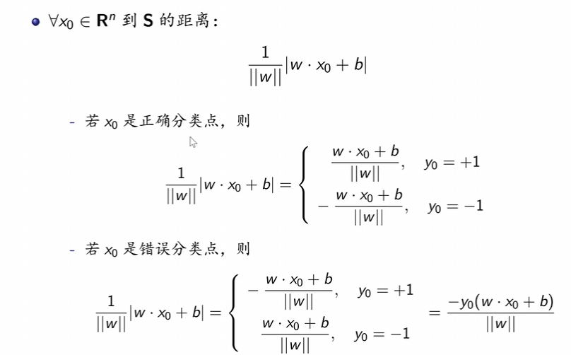
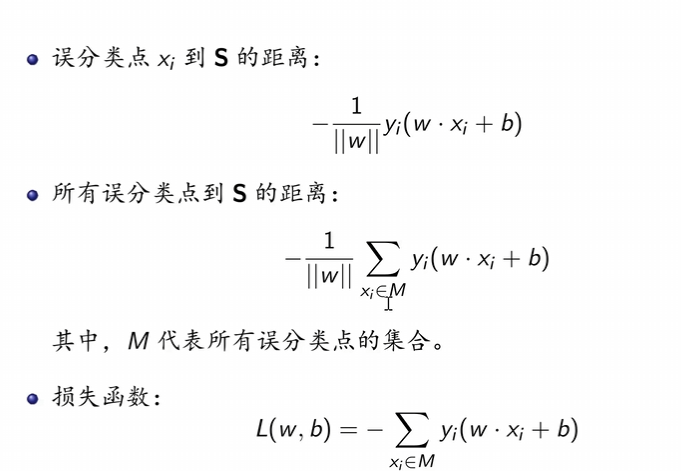
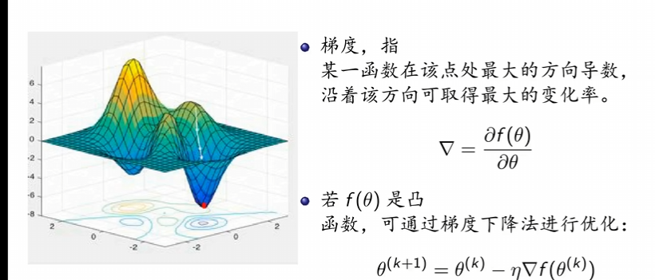
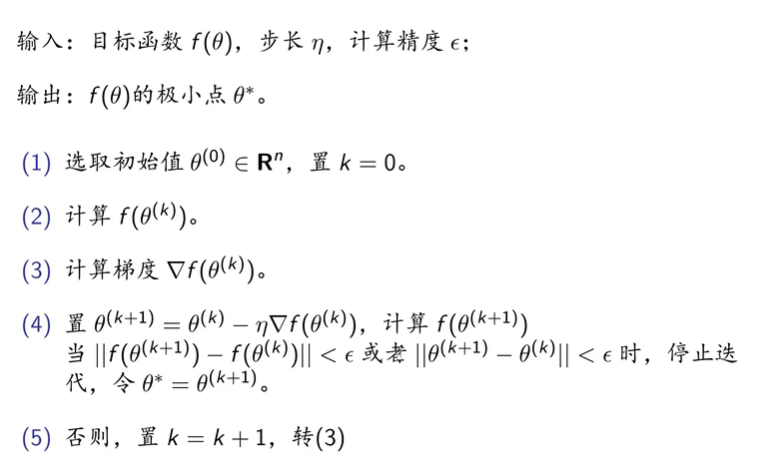
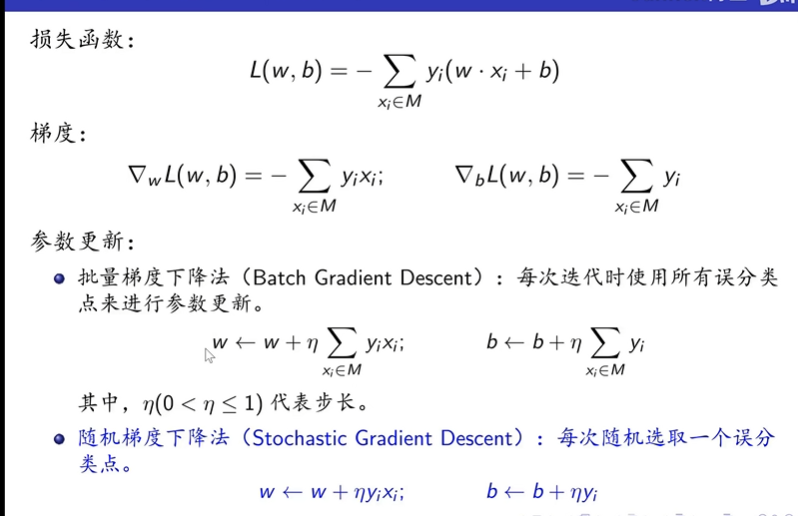
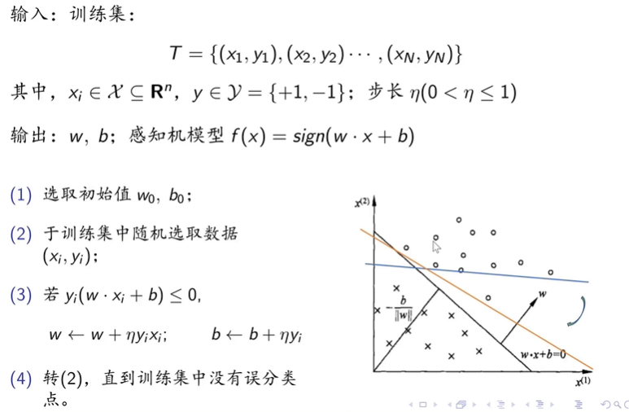
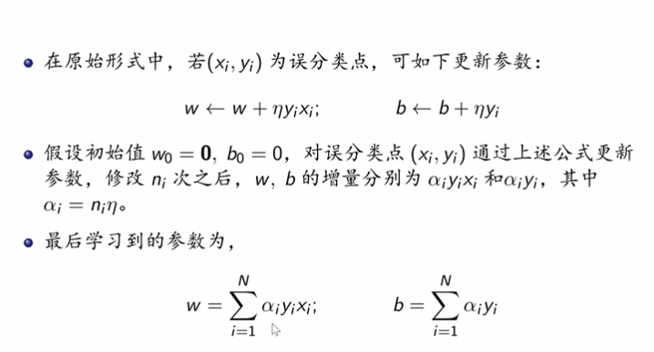
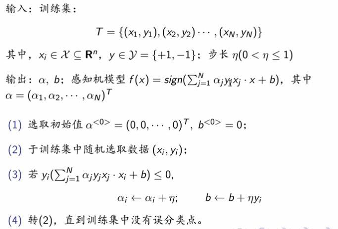

## 感知机
### 感知机介绍
{width=50%}
#### 学习策略
如何判定一个点是否正确分类
{width=50%}
如何表征损失函数
{width=50%}

### 梯度下降法
#### 基本概念
{width=50%}
#### 具体算法
{width=50%}

### 感知机原始形式算法
原始形式为随机梯度下降法： 
#### 基本信息
{width=50%}
#### 训练流程
{width=50%}

### 感知机对偶形式算法
#### 基本信息
{width=50%}
#### 训练流程
{width=50%}