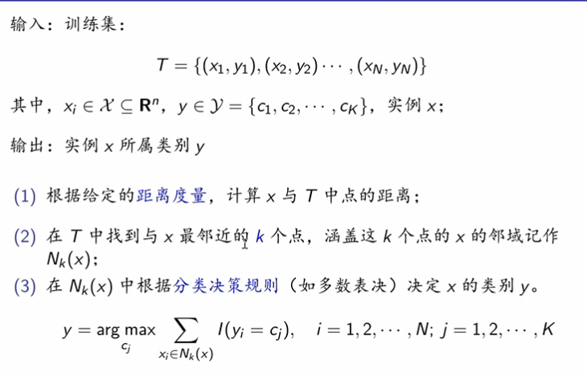
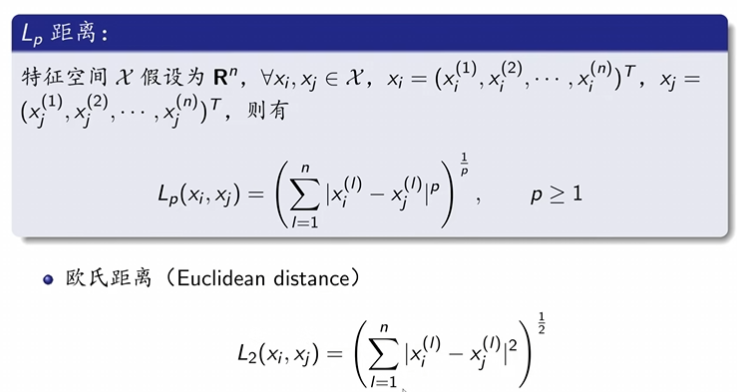
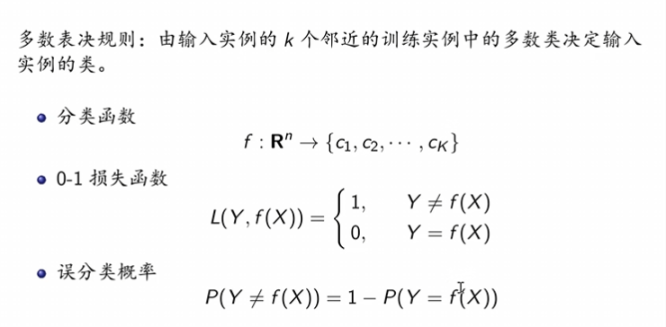
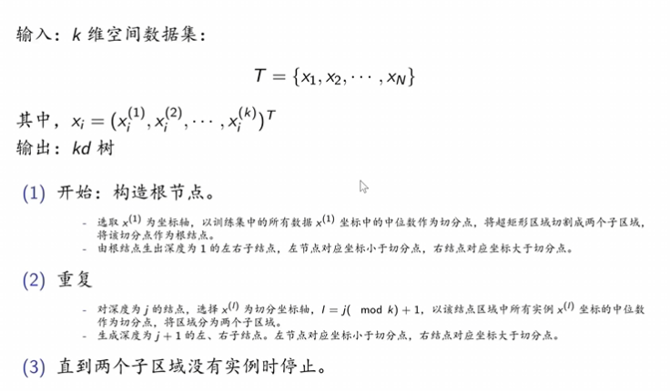
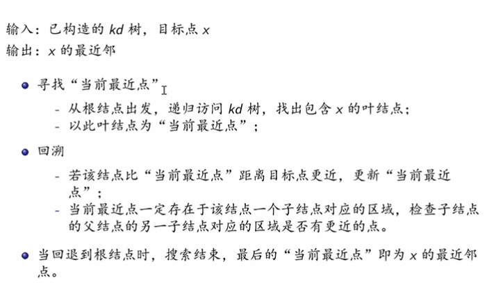

## k近邻法
### 简介
#### 主要思想
假定给定一个训练数据集，其中实例标签已定，当输入新的实例时，可以根据最近的K个训练实例的标签，预测新实例对应的标注信息。 
- 分类问题：多数表决
- 回归问题：均值计算

#### 算法流程 
{width=50%} 

### 三要素

#### 距离度量  
{width=50%} 
具体有：
- 欧式距离(p = 2)
- 曼哈顿距离(p = 1)
- 切比雪夫距离(p = 无穷)
#### k-值的选择
- 较小的k值，学习的近似误差减小，但估计误差增大，敏感性增强，而且模型复杂，容易过拟合。  
- 较大的k值，减少学习的估计误差，但近似误差增大，而且模型简单。
#### 分类决策规则  
{width=50%} 

### kd树
#### 定义
kd树时一种对k维空间中的实例点进行存储以便对其进行快速检索的树形数据结构。
- 本质：二叉树，表示对k维空间的一个划分
- 构造过程：不断地用垂直于坐标轴的超平面将k维空间切分，形成k维超矩形区域
- kd树的每一个节点对应于一个k维超距形区域

#### 构造kd树 
具体算法：
{width=50%} 

#### 搜索kd树  
具体算法：
{width=50%} 