## 朴素贝叶斯  
### 贝叶斯定理
#### 基本思维
基本方法是：先验概率 -> 调整因子 -> 后验概率。形象说明就是：主观判断 -> 添加新信息 -> 最终结论。

#### 贝叶斯分类
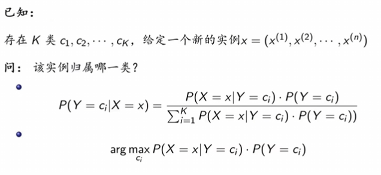{width=50%}  
上述为贝叶斯的公式，具体而言就是通过先验概率来计算出后验概率
**朴素贝叶斯公式**如下：
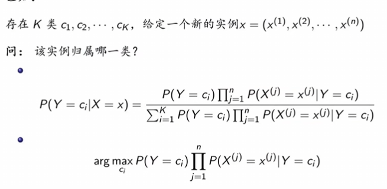{width=50%}  
由于分母是一致的，所以只需要关注分子即可，因此最大化时，最大化的是分子大小，
朴素贝叶斯推导过程如下：
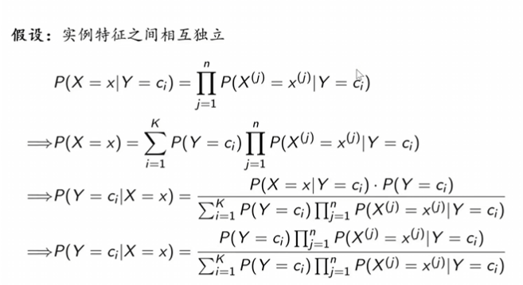{width=50%}  

#### 朴素贝叶斯：因何朴素
##### 基本方法
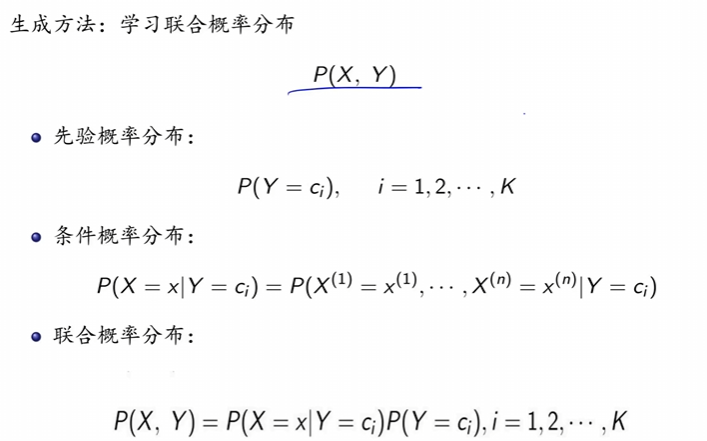{width=50%}  
##### 为什么要假设条件独立
随着特征数的增多，输入向量$x$的取值有了更多的可能，同样的输出向量$y$也有了更多的可能，随着特征数的增长，这些取值的可能数量是以指数级增长的。因此假设特征独立，能够使得取值不必全部罗列。

##### 后验概率最大化
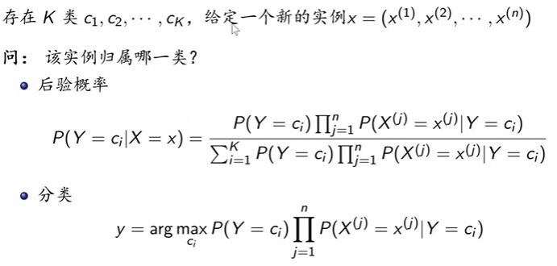{width=50%}  
成功将期望风险最小化转化为后验概率最大化。（证明未在这里写出）

### 极大似然法
为了最大化后验概率而提出的算法。
#### 计算的准备 
以下先验概率和条件概率
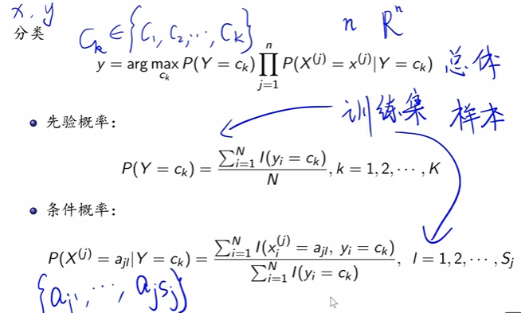{width=50%}  
其中$y$是最后需要最大化的后验概率
#### 最大化方法  

具体可以的解法有三类
- 遍历解：将所有取值空间的值全部试一遍，找出最大的后验概率，进而求得对应的值。
- 解析解：利用高等数学知识进行求导
    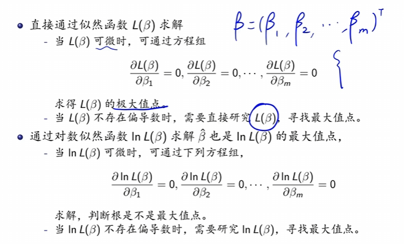{width=50%}  
- 迭代法：EM步，得到一个近似解

### 实际算法
基本信息：
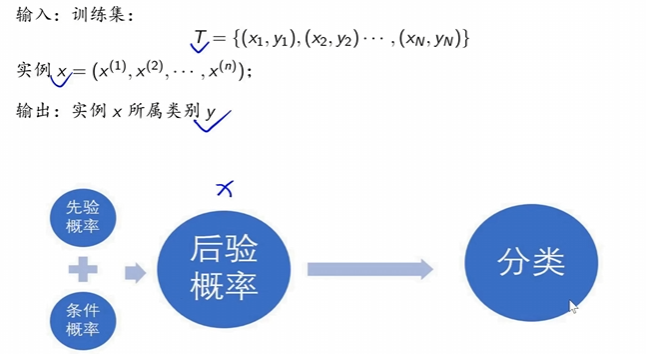{width=50%}  
其中后验概率即为需要优化的$y$。通过此方法可以通过前验概率计算出后验概率。

### 贝叶斯估计
#### 估计方法
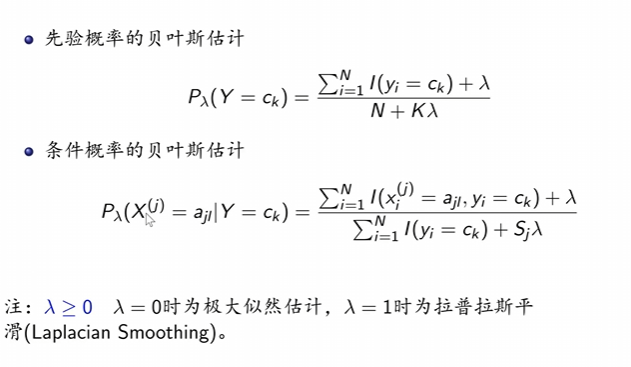{width=50%}  
#### 估计例子
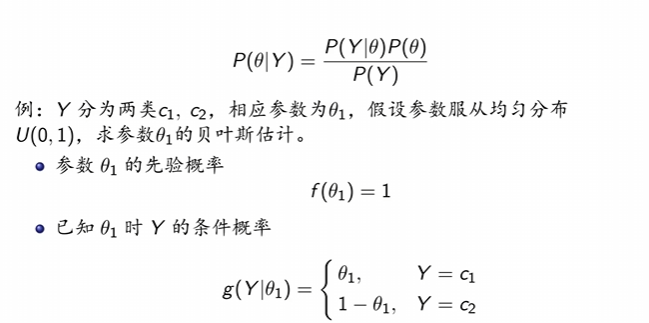{width=50%}  
#### 为什么需要平滑项（即估计方法中的$\lambda$
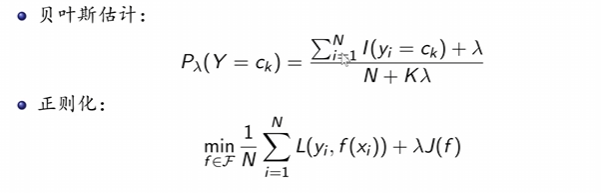{width=50%}  
加入先验概率既为了避免过拟合，同时也可以避免除0的问题。
其中$K$是在这个属性($Y$)上的空间数量。
最后的结果是$极大似然概率 + \lambda \times 先验概率$ 
解法可以参照：
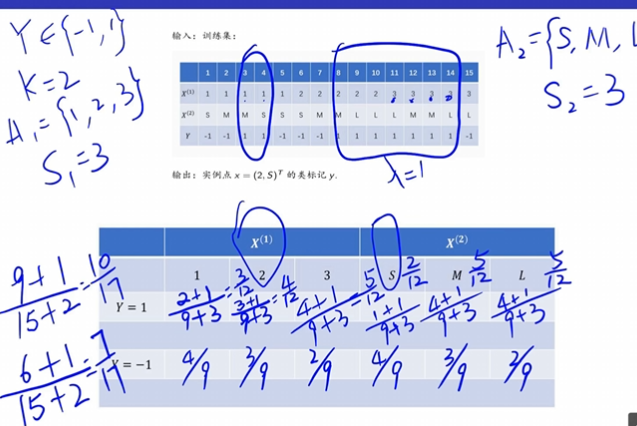{width=50%}  
- Y左侧的概率为先验概率
- Y与X的交点上为条件概率