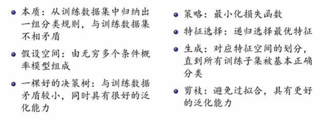
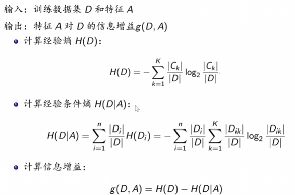
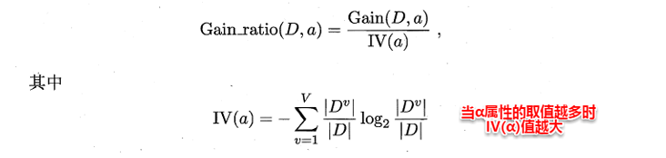
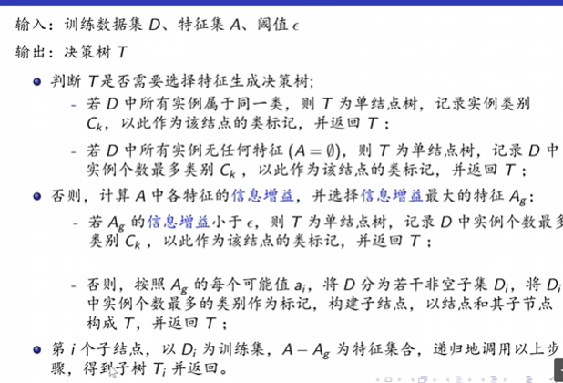
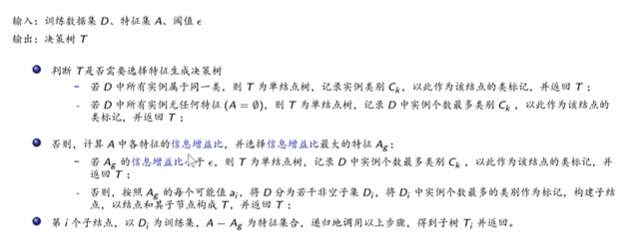
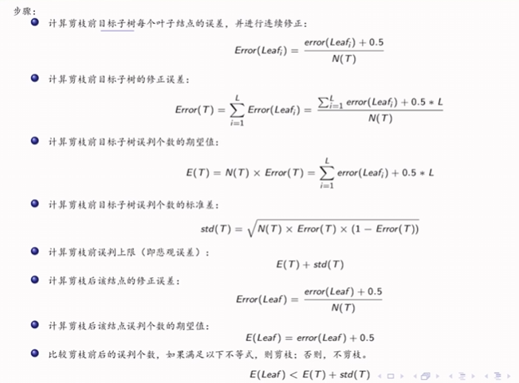
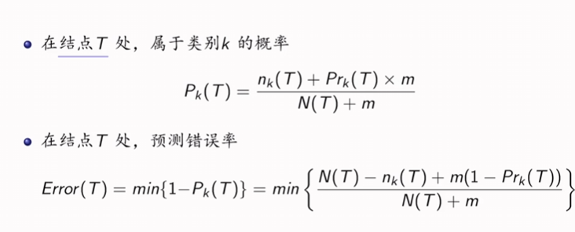
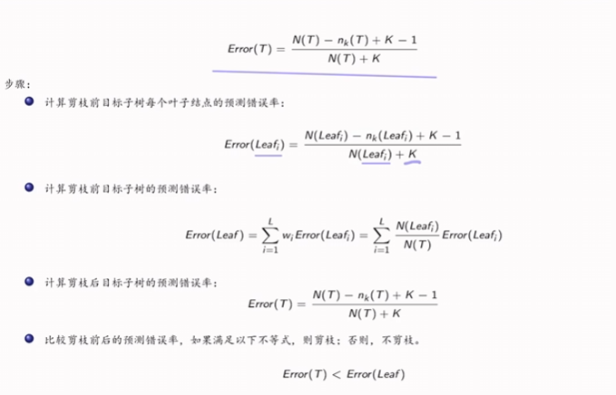

## 决策树  
### 概念
分类决策树是一种描述对实例进行分类的树形结构，是通过一系列规则对数据进行分类的过程。  
#### 构建步骤 
1. 构建根节点 
2. 选择最优特征，以此分类训练数据集  
3. 若子集被基本正确分类，构建叶节点，否则继续选择新的最优特征。
4. 重复上述两步，直到所有训练数据子集被正确分类  

#### 基本学习方法 
{width=50%} 

### 特征选择： 信息增益
#### 信息增益
{width=50%} 
注意此处条件熵中**第二个等号并不成立**，$H(D_i)$ 化简出来的结果中分母应该为$D_i$ 。

#### 信息增益比
{width=50%} 
为了防止因为特征对应的取值空间大小影响选择结果，因此引入信息增益比。

**选择信息增益还是选择信息增益比要根据实际情况来进行判断。例如：承受风险能力越强就选择信息增益，否则选择信息增益比**

### 决策树生成
#### ID3算法  
算法总览：
{width=50%} 
针对于判断$T$是否需要选择特征生成树，两种不需要向下进行的分别是：
1. 无需分类，因为所有实例按照定义都属于同一类别。比如：希望能根据特征（如湿度，温度等）判断晴天雨天，如果这一实例中全是晴天就无需再分类。
2. 没有可以选择的能够有区分度的特征了

**阈值的$\epsilon$代表**，如果信息增益小于这个阈值，就不进行分类。

#### C4.5算法 
算法总览：
{width=50%}  
最主要的特征是采用**信息增益比**而不是信息增益，同时可以**处理连续的数值** 。

### 剪枝  
优秀的决策树：
在具有好的拟合和泛化能力的同时，
- 深度小（所有节点的最大层次数）
- 叶节点少
- 深度小并且叶结点少

#### 预剪枝
生成过程中，对每一个结点划分前进行估计。若当前节点的划分不能提升泛化能力，则停止划分，记当前节点为叶节点。
- 限定决策树的深度 
- 设定一个阈值（C4.5算法）
- 设置某个指标，比较结点划分前后的泛化能力
    利用测试集对训练出来的决策树从上到下逐节点进行评估，计算其评估出来的误差率，然后比较不分裂和分裂的误差率。（注意针对单个节点分裂时，其分裂出来的节点应该全为叶节点，根据实例占比来决定该叶节点应该属于哪个结果）

#### 后剪枝
生成一颗完整的决策树之后，自底向上对内部节点考察。若此内部节点变为叶节点，可以提升泛化能力，则做此替换。
- 降低错误剪枝(REP)
    自下而上，使用测试集来剪枝。对每个节点，计算剪枝前和剪枝后的误判个数，若是剪枝有利于减少误判（包括相等的情况），则减掉该结点所在分支。
    - 计算复杂度低 
    - 操作简单
    - 受测试集影响大，如果测试集比训练集小很多，会限制分类的精度。
- 悲观错误剪枝(PEP)
    只需要训练集不需要验证集，而且是自上而下地进行剪枝的。
    {width=50%}  
- 最小误差剪枝(MEP)
    自下而上剪枝，只需要训练集。
    根据剪枝前后的最小分类错误概率来决定是否剪枝。
    {width=50%}  
    实际算法：
    {width=50%}  
- 基于错误的剪枝(EBP)
- 代价-复杂度剪枝(CCP)