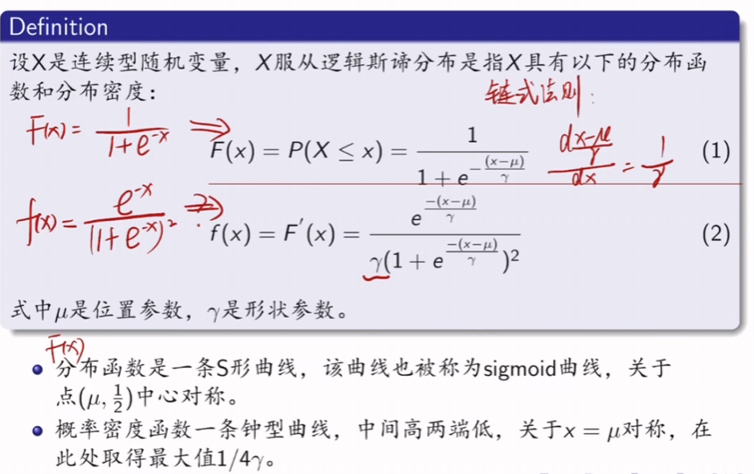
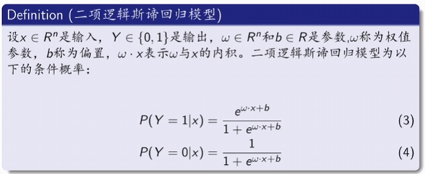
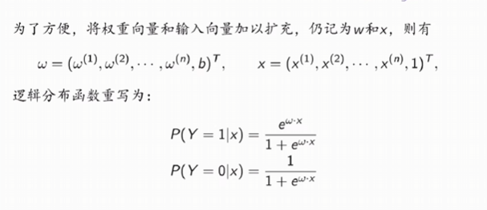
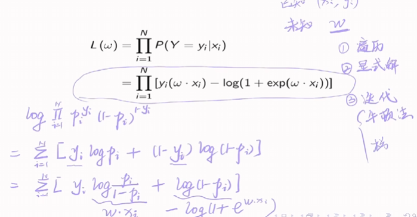

## 逻辑回归
### 数学前提
逻辑斯蒂分布（逻辑）：
{width=50%} 
回归问题：
{width=50%} 
### 逻辑回归模型  
算法的具体实现
{width=50%} 
将分类问题转化为逻辑回归问题。
- 该模型的输入输出变量之间不局限于线性关系
- 逻辑回归的输入变量可以是连续变量或离散变量
- 参数估计采用最大似然估计法

最后利用最大似然估计法得到结果，之后对结果通过一些方法可以求解出最大化结果的参数是多少。
求解策略：
- 遍历
- 显式解
- 迭代法（牛顿法，梯度下降法）

{width=50%} 
**注意到第二行的式子是对第一行的概率求对数后的结果，所以应该为累加而不是累乘。**