## 最大熵模型
### 最大熵原理
#### 离散部分
如下为最大熵定义，以及在常规约束条件下的结果
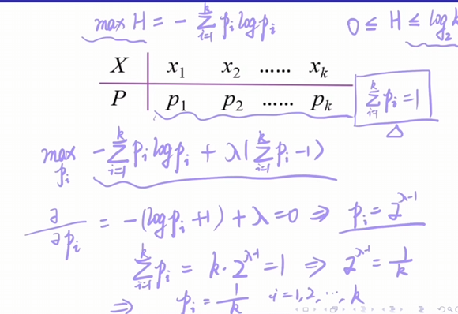{width=70%}

#### 连续部分
在连续随机变量的均值为$\mu$，方差为$\sigma ^2$，则最大熵对应的概率分布应该正态分布。
利用拉格朗日乘子法后求导，可以逐步得到该结论。

### 模型介绍  
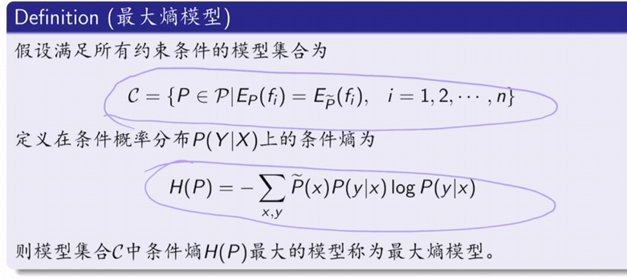{width=70%}
第一个式子代表着满足条件的模型集合，第二个在计算**条件熵**。使用条件分布而不是联合分布是因为该模型是生成模型，目标是条件分布。

针对于上图中的经验分布，可以通过如下方式加入约束。
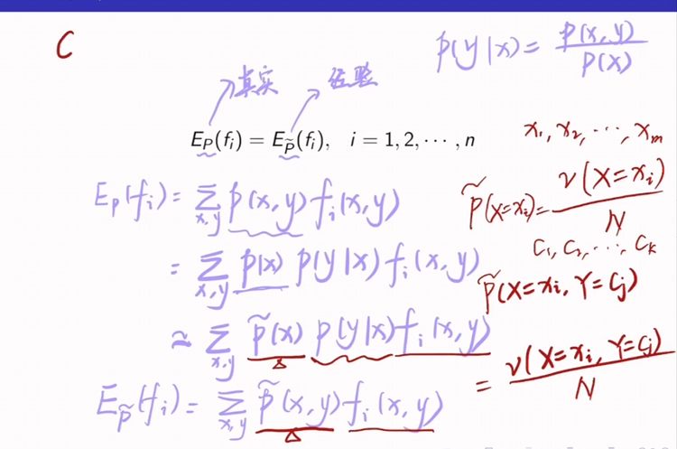{width=70%}
经过变换后成功得到了求和后等于某个经验值的约束。

转化为数学的原始问题后，可以得到优化的目标是：
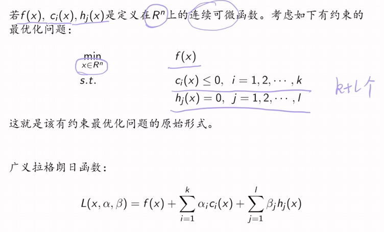{width=70%}
进而考虑如何最优化问题
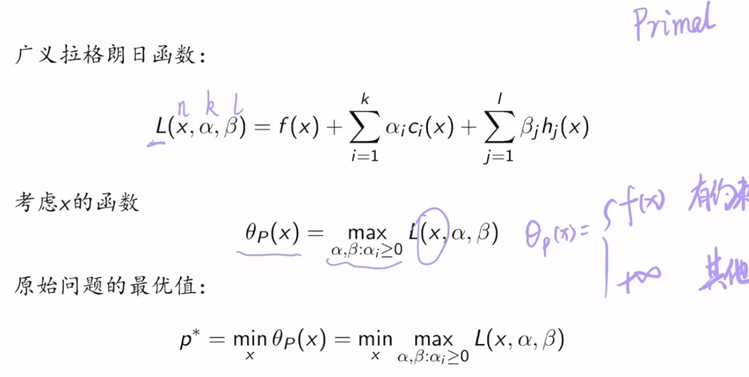{width=70%}

更近一步在原始问题的基础上进行拓展，拓展为对偶问题：
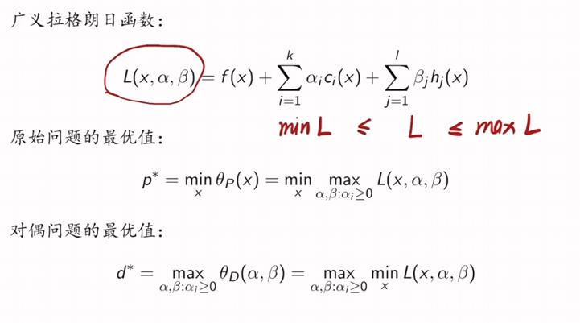{width=70%}
进一步得到：
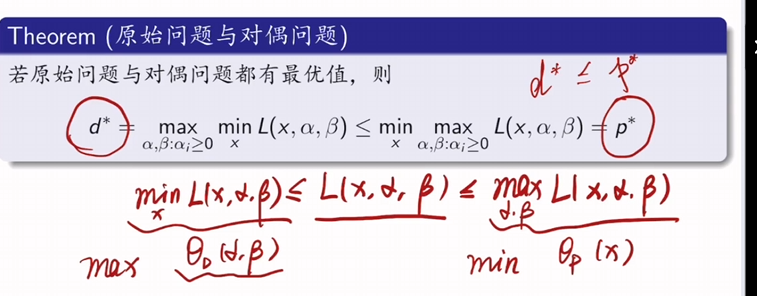{width=70%}

##### KTT条件
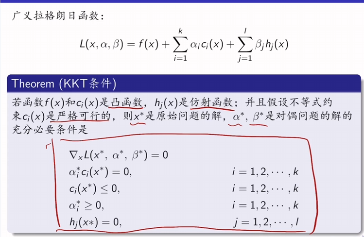{width=70%}

### 最大熵模型的学习 
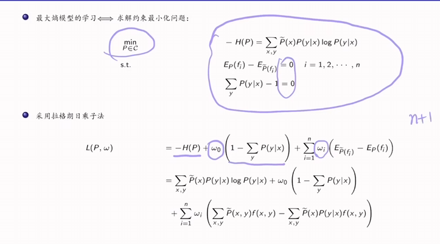{width=70%}
可以证明出来$H(P)$是一个严格凸函数，证明略。
最后可以得到的条件概率是：
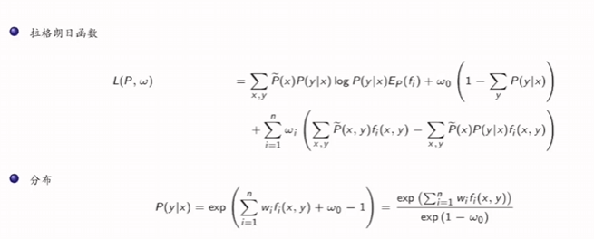{width=70%}
其中分母存在未知数，利用概率求和为1可以解析出$w_0$的结果.
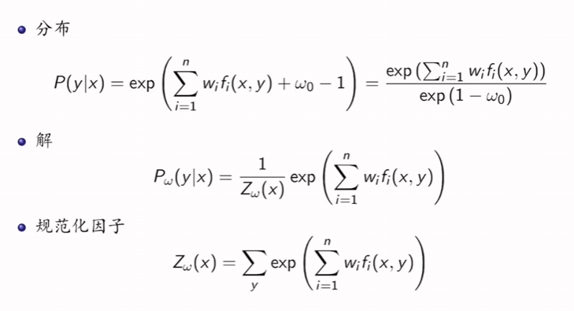{width=70%}
最后**将条件概率带入到$L(P,w)$**即可.
至此内部极小化问题已经解决，下面需要解决外部极大化问题。
具体而言步骤应该如下：
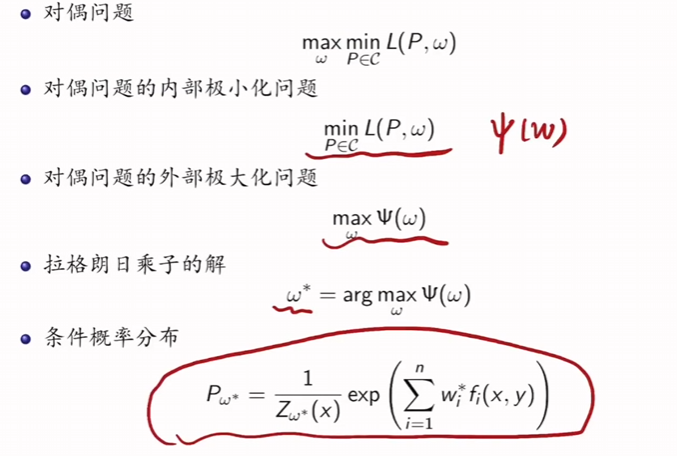{width=70%}
注意无论是内部极小化还是外部极大化针对的主要还是$L(P,w)$，对$w$求导时也是对极小化产生的结果求导。
$w$的求解方式有很多。
对得到的结果进行化简得到的结果于极大似然估计的结果一致，因此对偶函数等价于对数似然函数。
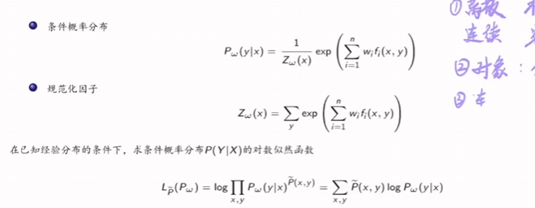{width=70%}

### 优化算法
#### 梯度下降法
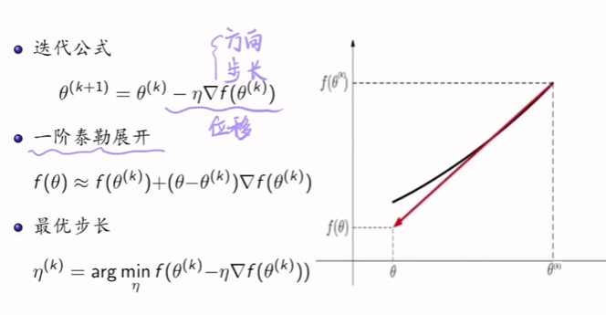{width=70%}
具体的步骤：
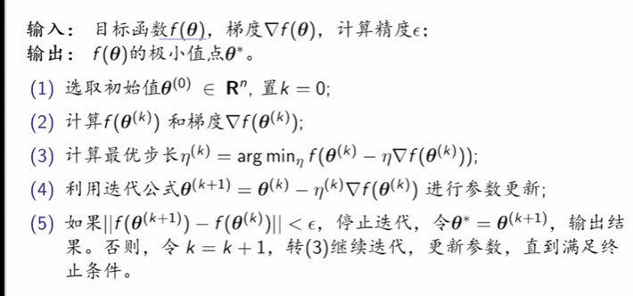{width=70%}
在最大熵模型中的步骤为：
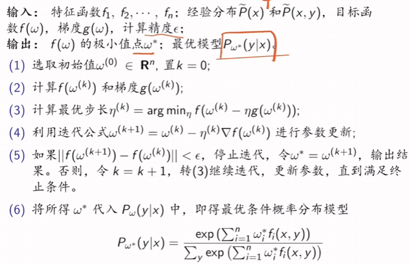{width=70%}

#### 牛顿法  
本质是求解零点，大致思想为：
1. 找函数在该点位置的切线 
2. 利用切线与x轴的交点作为新的x值

具体求零点步骤是：
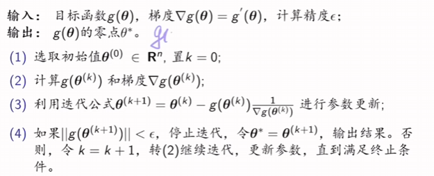{width=70%}
在实际运用的时候，$g(x)$是目标函数$f(x)$的导函数。

多元情况下的牛顿法：
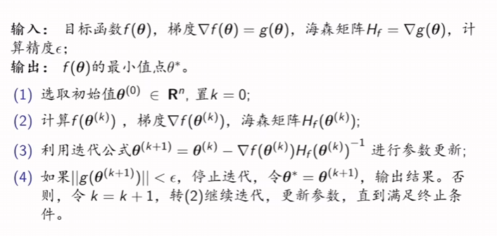{width=70%}
  
##### 拟牛顿法
因为逆矩阵的求解复杂度较高，因此采用拟牛顿法较好。拟牛顿法类似于牛顿法与梯度下降法的结合。

- DFP算法  
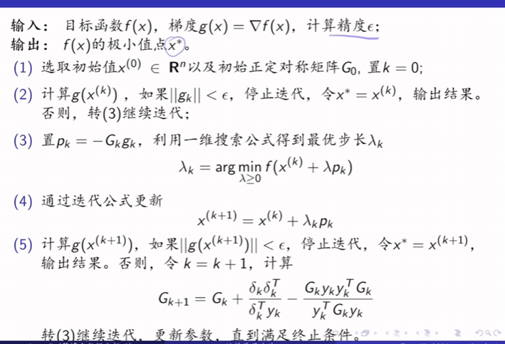{width=70%}

- BFGS算法
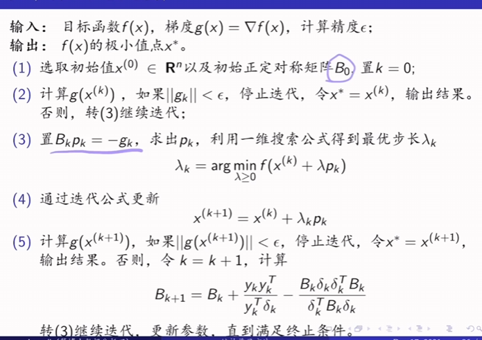{width=70%}

##### 迭代尺度法
这种方法进能用于最大熵模型中  
此处仅作简要说明：
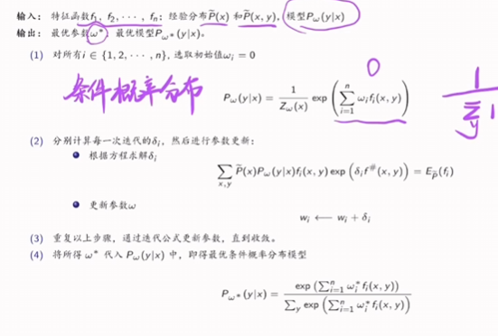{width=70%}

