## 支持向量机
### 支持向量机的一些基本情况  
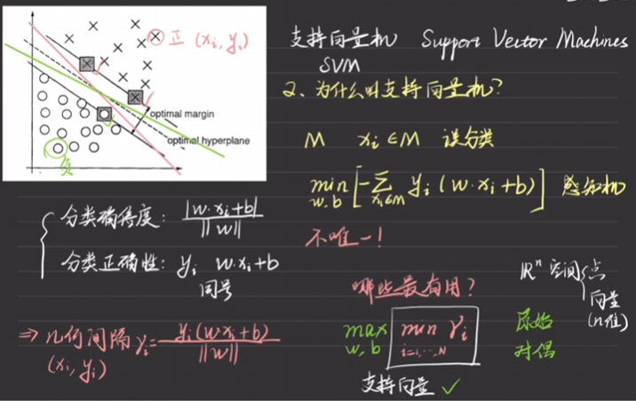{width=60%} 
可以证明最优解**唯一且一定存在**，证明过程略。

### 基本算法
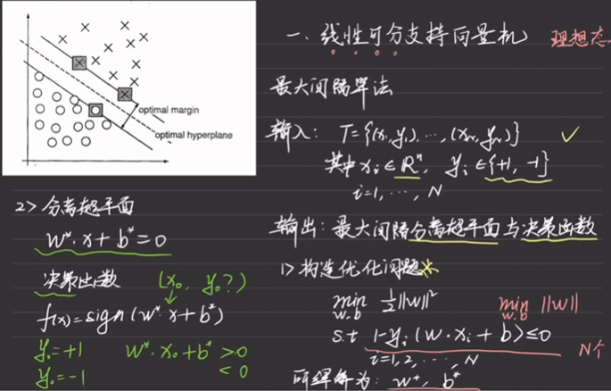{width=60%} 

上述基本算法很难实现，如何进行优化 
#### 对偶问题
内部极小化
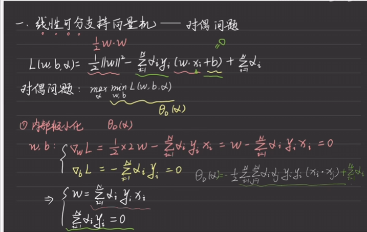{width=60%} 
外部极大化
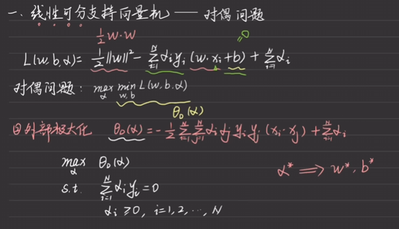{width=60%} 
此时得到$\alpha$，下面讲述如何通过$\alpha$得到$w,b$。
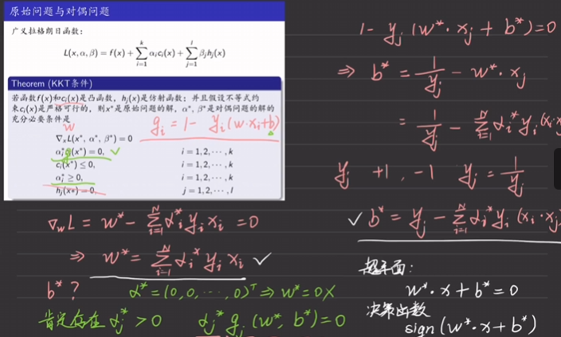{width=60%} 
可以看出满足对应的$\alpha$非零的$(x^{(1)}_i,x^{(2)}_i)$就是支持向量。

### 线性支持向量机
相比于最开始的算法，由硬间隔变换为软间隔。
#### 原始问题
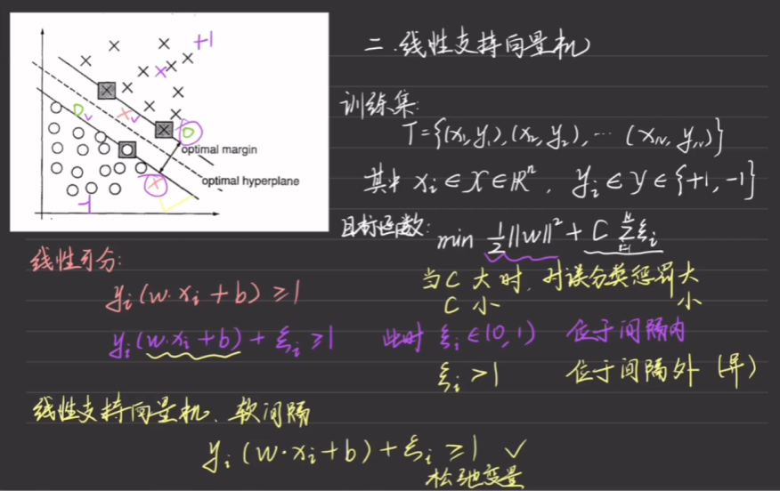{width=60%} 
其中系数$C$的作用是对误分类的惩罚设置大小。

#### 对偶问题
先来看一个对比
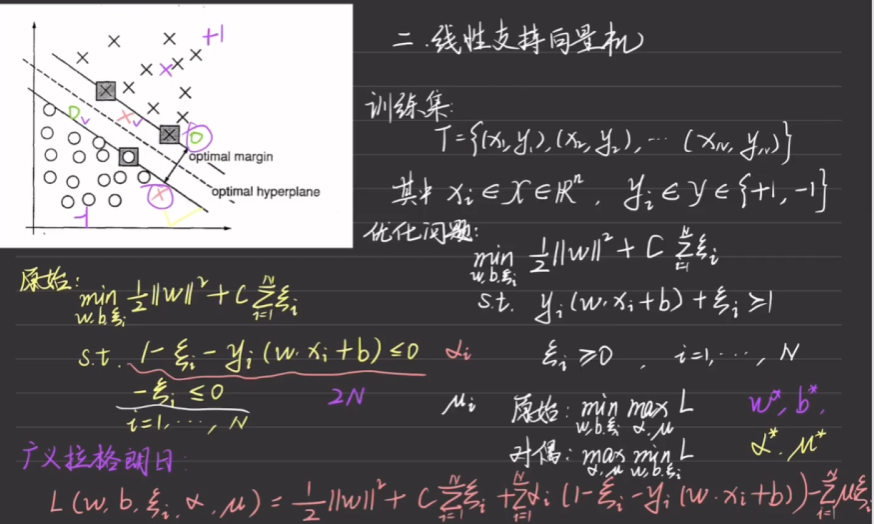{width=60%}
实际的求解方法：
内部极小化->外部极大化
 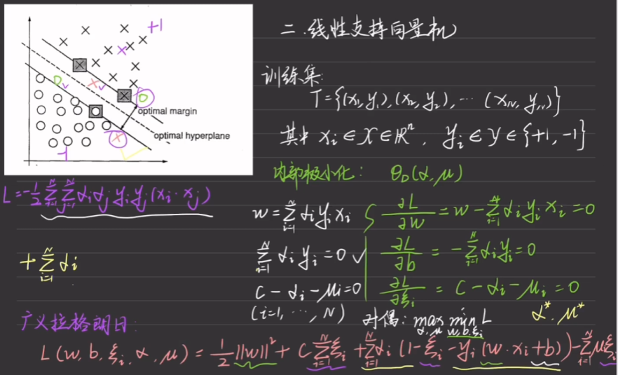{width=60%}

 #### 算法流程
  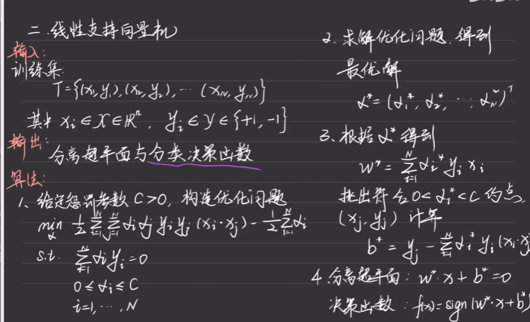{width=60%}
  同时需要注意的是，此时的支持向量不再仅仅是边界上的点了。
  如果$ 0 < \alpha < C  \rightarrow  \epsilon = 0$ ,此时的支持向量在边界上。
  如果$ \alpha = C \rightarrow \rightarrow \epsilon>0$，即此时的支持向量是间隔内的点，超平面上的点和另一边的误分类点。

#### 合页损失
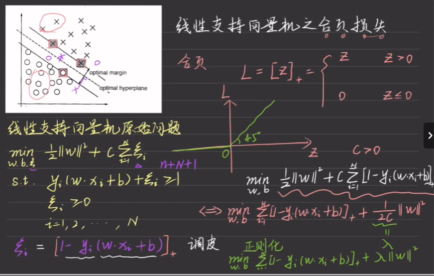{width=60%}
注意观察损失函数，其中$[]_+$是合页函数，所以相当于是一个正则化的过程。

### 非线性支持向量机
线性与非线性的比较：
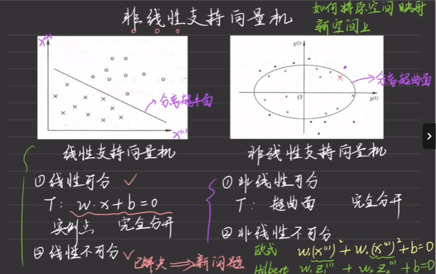{width=60%}
将非线性转化为希尔伯特空间中，得到一个线性函数，关键在于如何进行转化。

#### 核函数
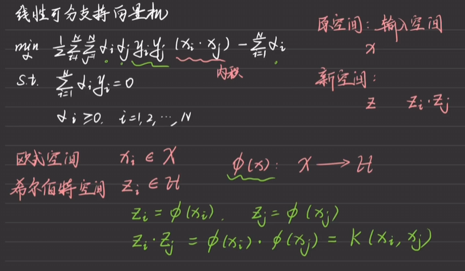{width=60%}
注意观察$(x_i,x_j)$作为目标函数中的内积，在非线性中可以转化为两个点在希尔伯特空间中的内积，定义这样的内积问核函数$K(x_i,x_j)$。因此我们不必关心映射到底是什么，而是着重关注核函数的形式。
由于原来是内积，因此最后得到核函数的矩阵应该是对称的（半正定矩阵）。
补充说明：变换到希尔伯特空间可以认为是提升向量的维度，使低维不可分的点在高维中变的可分。
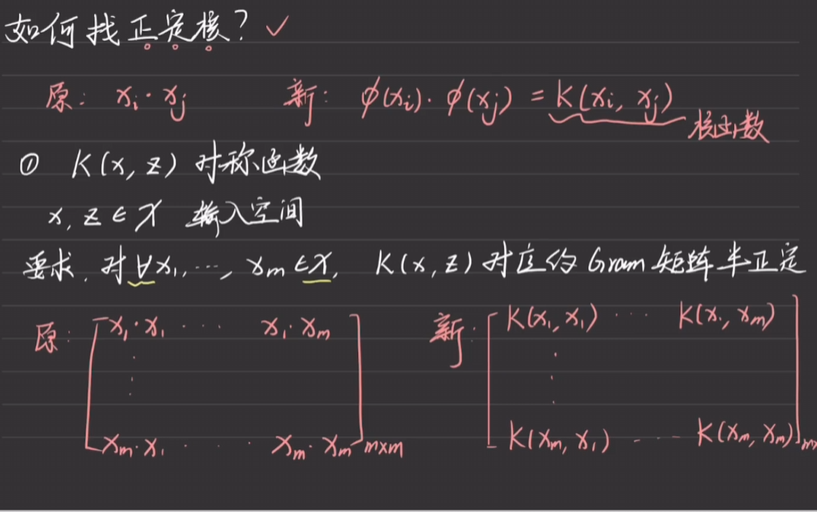{width=60%}  
常用核函数：
- 欧式空间下：
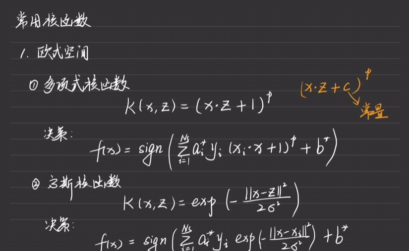{width=60%}
- 离散合集上 
  考虑使用余弦相似度
  例子如下：
  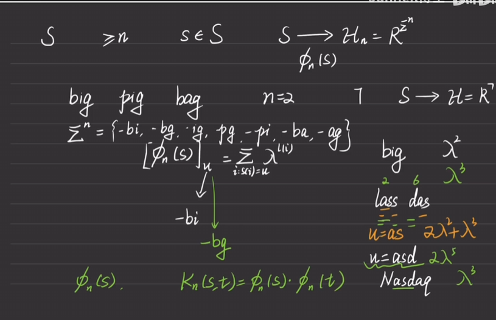{width=60%}

### 总结
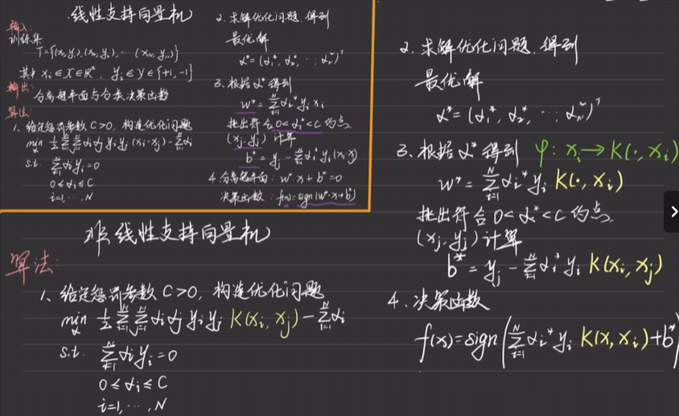{width=80%}
接下来是具体的优化问题解决方案：
#### 坐标下降法 
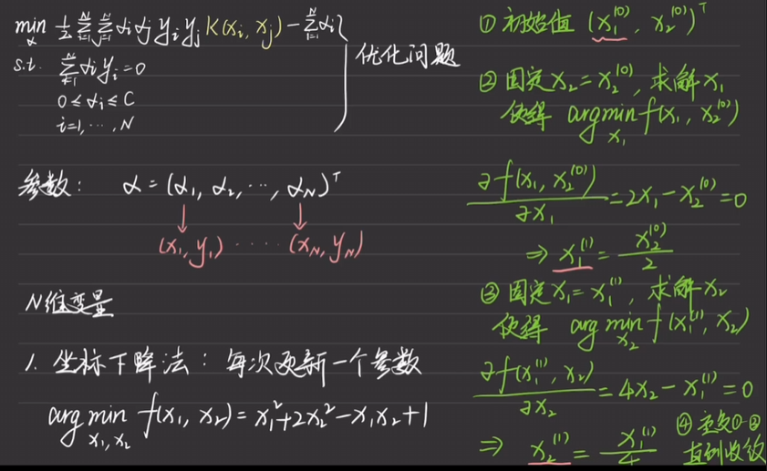{width=60%}
但是无法用于线性支持向量机，因此提出了新的方法。
#### SMO 序列最小最优化算法  
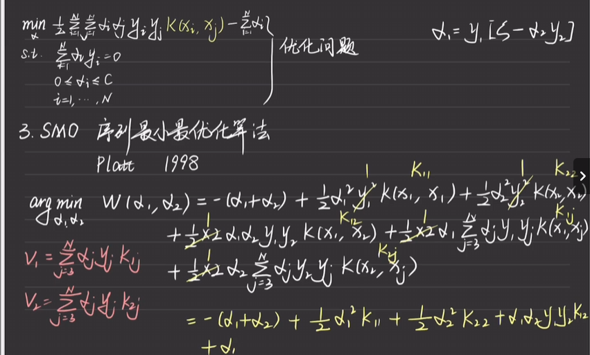{width=60%}
不同于坐标下降法**一次只将一个参数作为变量**，SMO一次将**两个参数作为变量**进行考察。
上式中可以明显看到$\alpha_1$可以用 $\alpha_2$表示出来，即$\alpha_1 = (\sum_{i=3}^{N} \alpha_i * y_i - \alpha_2 * y_2)*y_1$
带入$w$中可以得到：
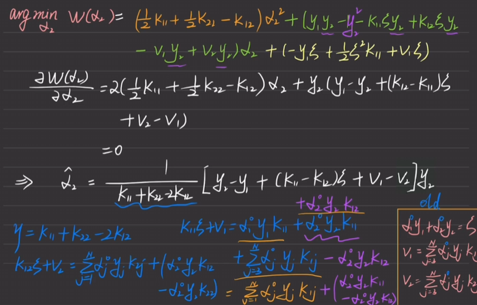{width=60%}
此时对$\alpha_2$求导就可以得出对应的结果。
经过一系列化简后可以得到：
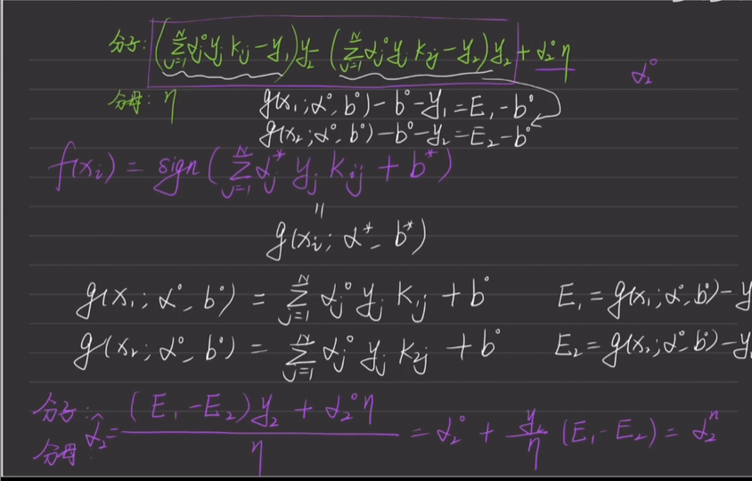{width=60%}
得出了$\alpha_2$的更新方式，并且由于存在限制条件，因此我们需要对该式进行验证，结果如下：
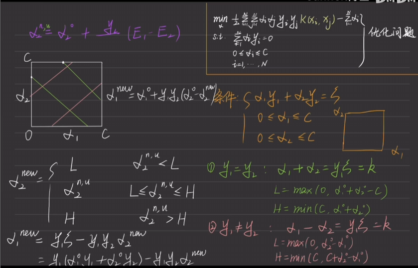{width=60%}
最终得到了$\alpha_2$和$\alpha_1$的更新结果。
此时更新$w,b$可以得到新的参数，特别注意的是$b$的更新较为特殊：
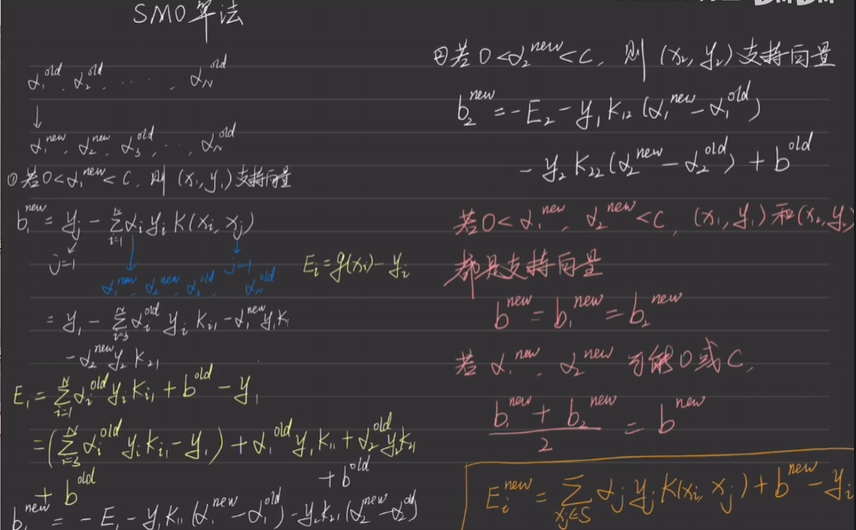{width=60%}

最后对算法进行总结可以得到：
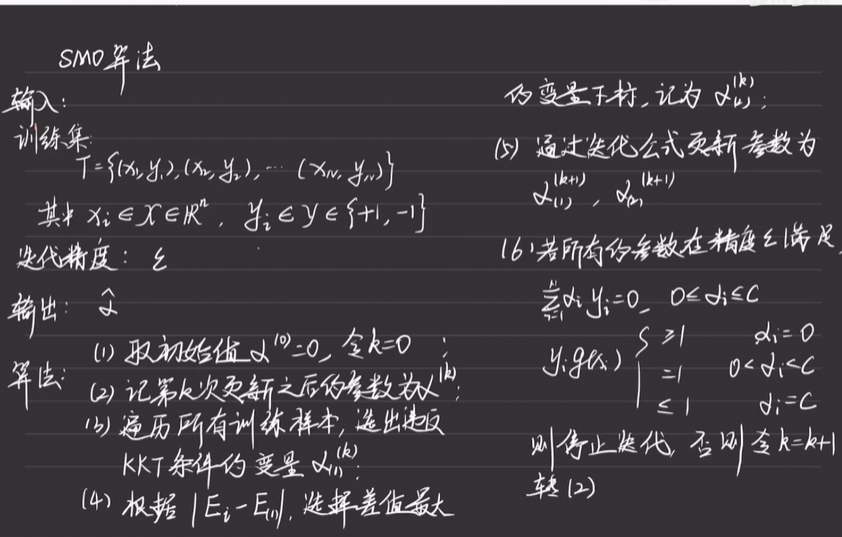{width=60%}