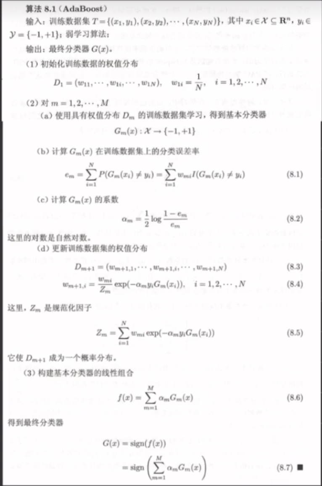
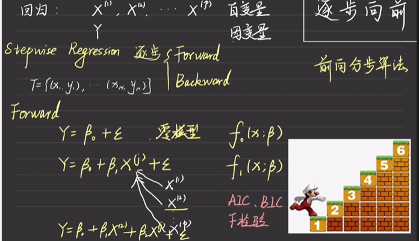
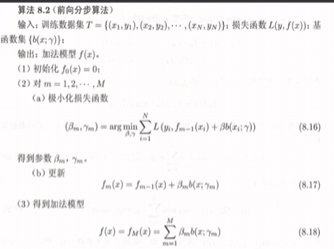
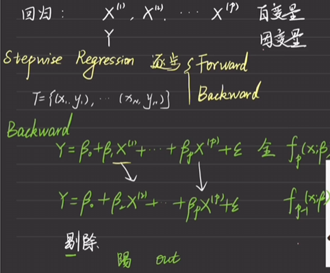
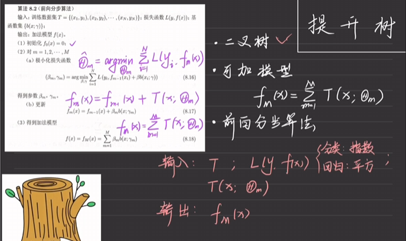
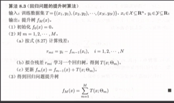
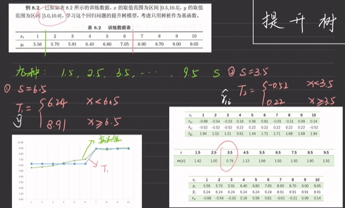
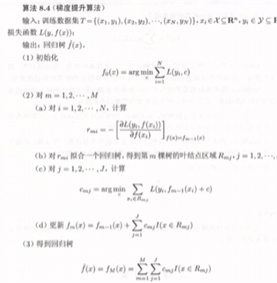

## 集成方法

### adaboost算法
 {width=60%}

 ### 逐步回归算法
 #### 逐步向前算法
  {width=70%}
  模型从最开始算起，逐步加入因变量$x^{(j)}$，每一次迭代都加入分类效果（判断标准有AIC,BIC）最好的那个剩下的变量（即之前被选择的变量不能再次被选择），直到模型相比于之前没有变得更好，就可以停止了。
  {width=60%}
#### 逐步后向算法
{width=70%}
每次剔除一个因变量，选择一个剔除后能让模型变好的幅度最大的，直到不可能因为剔除变量而变得更好为止。（类似于剪枝）

### 提升树  
{width=70%}
基于前向分步算法。得到对应的提升树算法。最终求和如果是分类任务，采用众数；如果是回归任务可以采用平均数，中位数等。
注意决策树做回归任务时，依旧是按$x$的值进行分类的，只不过每个$x$会算出不同的$f(x)$，所以做平均值的时候，应该是同一分类下的值做平均；算损失函数的时候，应该是$f(x) - T(x)$，其中$T(x)$是决策树按照对应$x$得到的结果（即这一类的均值）。
{width=80%}
具体而言我们可以使用前一次得到的误差项得到一个回归树，作为新一轮的$f(x)$，例如：
{width=80%}

### 梯度提升算法

{width=60%}