## EM算法  
### 具体过程 
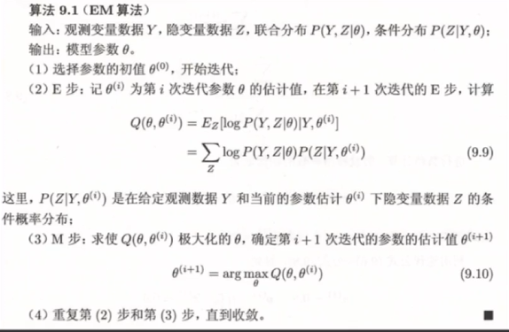{width=70%}
通过先验知识$Y,\theta$可以得到$Z$的条件概率分布，即$P(Z | Y,\theta^{(i)})$。相当于先固定$\theta$，得到隐变量$Z$的值，然后再求大化$Q$得到新的$\theta$然后重复上述步骤。 
E步的主要目的是求解条件概率分布和得到损失函数，M步主要目的是求得最小化损失函数对应的参数/
**EM算法结果与设置的初始值高度相关，所以要谨慎设置初始值。**
### 高斯混合模型 
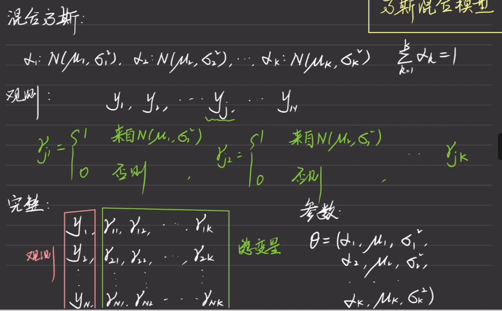{width=70%}
以上是基本的一些参数，其中$y$是观测值，$\gamma$是隐变量。其中$N()$代表着高斯分布，所以有$K$个高斯分布。
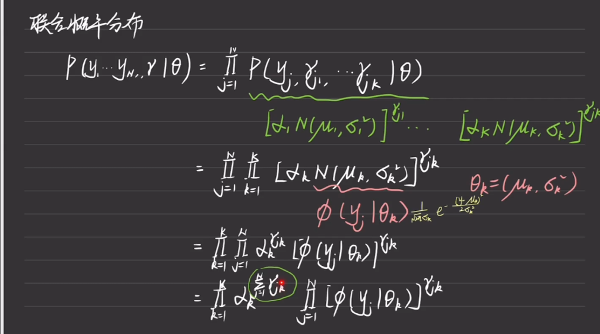{width=70%}
其次是求解联合概率分布，将最开始的参数进行带入得到.
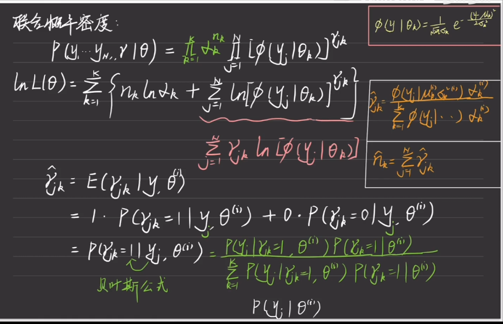{width=70%}
求解隐变量和损失函数。下面对E步进行总结，并且得到M步需要解决的问题。
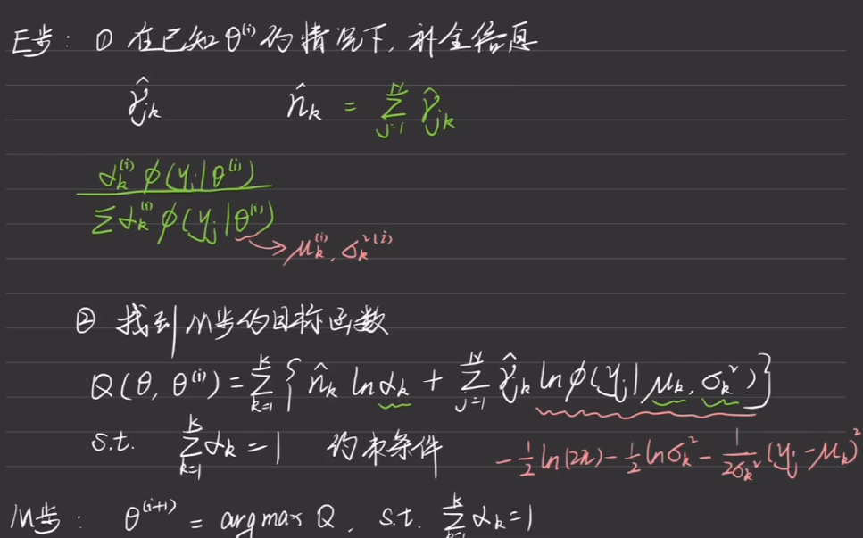{width=70%}
之后用拉格朗日乘子法即可得出结果为：
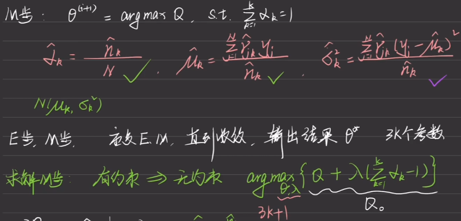{width=70%}
步骤大概可以认为是：
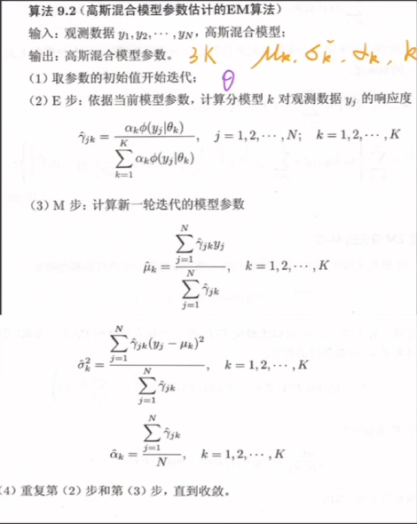{width=70%}
### GEM算法  
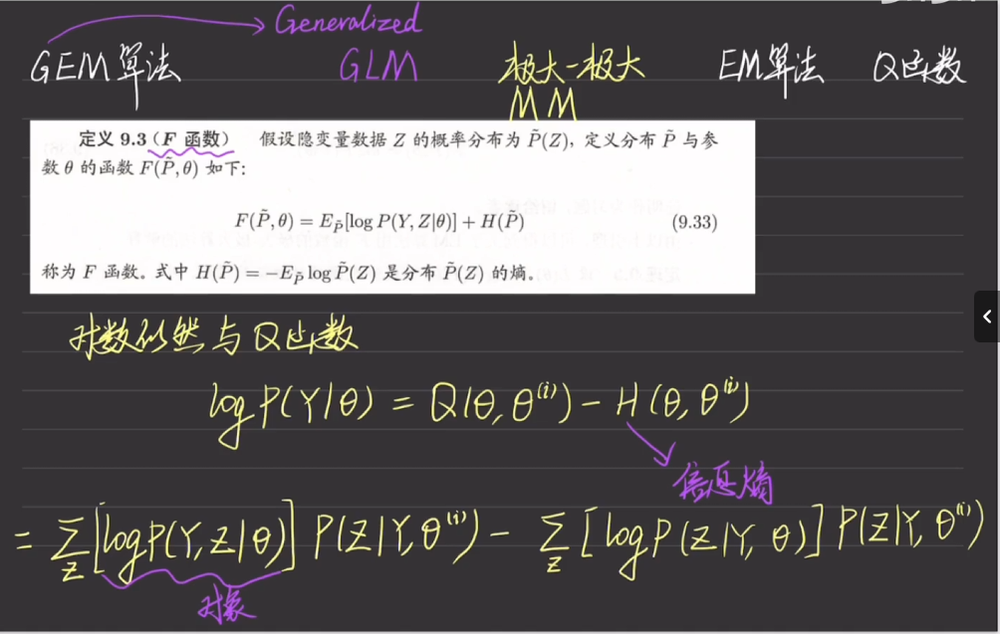{width=70%}
#### 具体步骤  
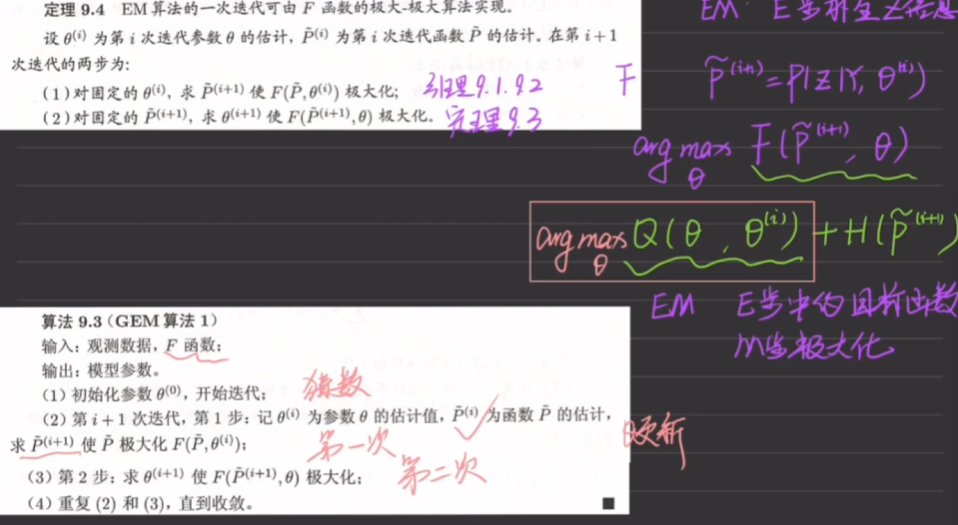{width=70%}
由于很难直接取得最大值，因此在此基础上进行改良：
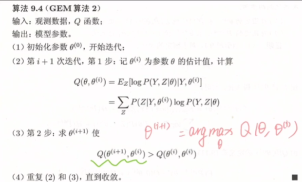{width=70%}
结合坐标下降法，再进行改良：
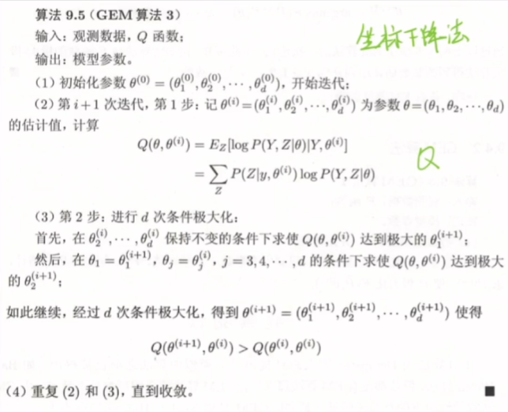{width=70%}