## 隐马尔可夫模型  
### 马尔可夫链简介
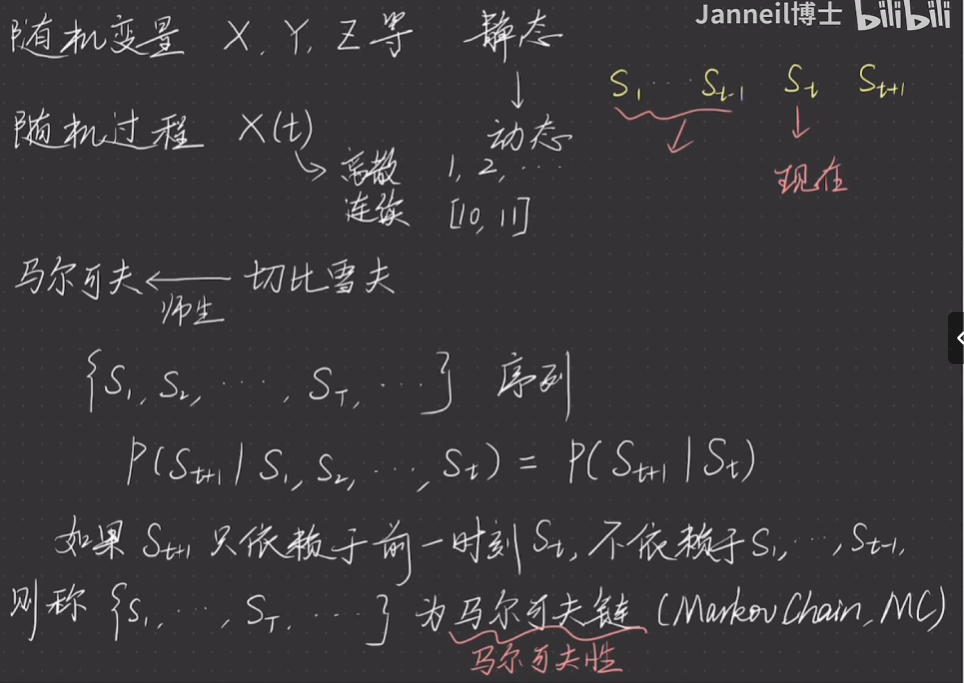{width=60%}
该时刻状态仅依赖于前一时刻的状态。
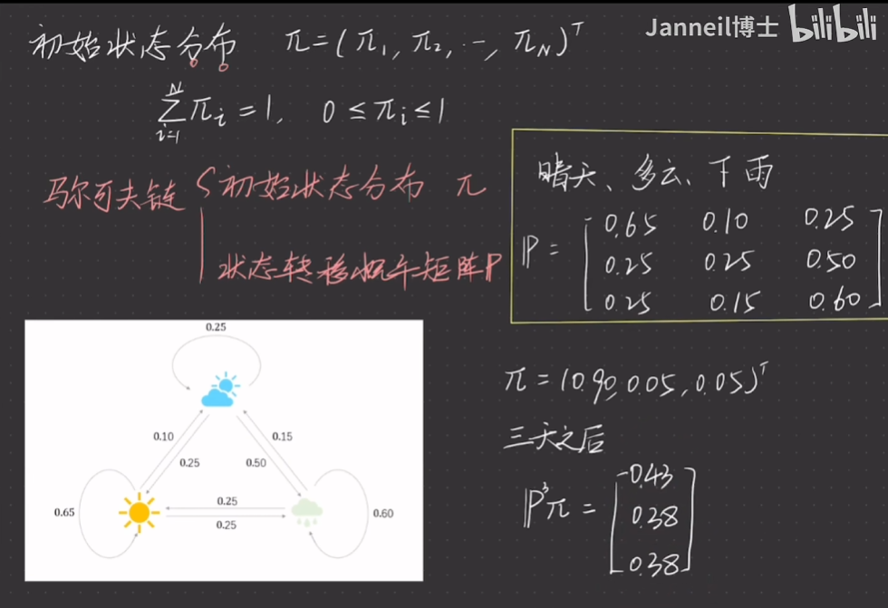{width=60%}
马尔可夫链最重要的两个初始值为：初始状态分布，状态转移概率矩阵。
### 隐马尔可夫模型 
由原来的两要素变为三要素。
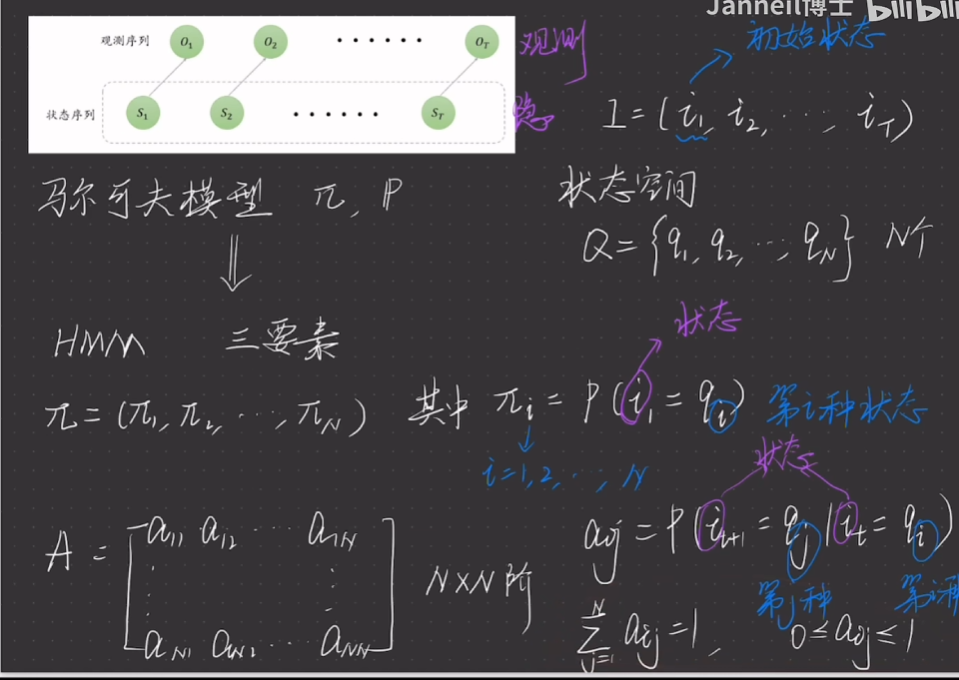{width=60%}
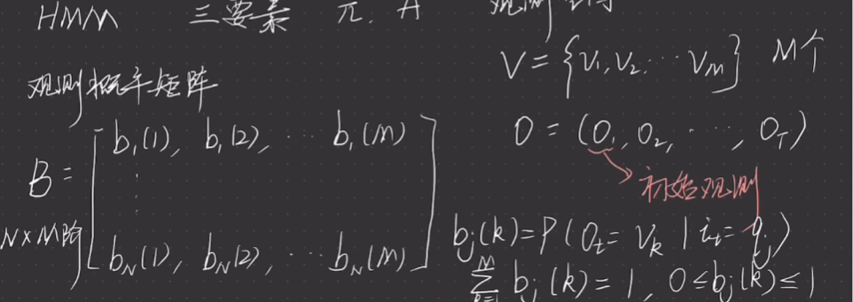{width=60%}
有初始状态分布概率$\pi$，状态转移概率矩阵$A$，观测概率矩阵$B$.
#### 观测序列的生成  
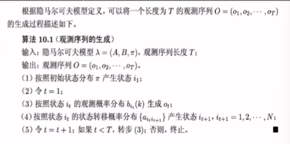{width=60%}
### 概率计算算法  
#### 直接计算法  
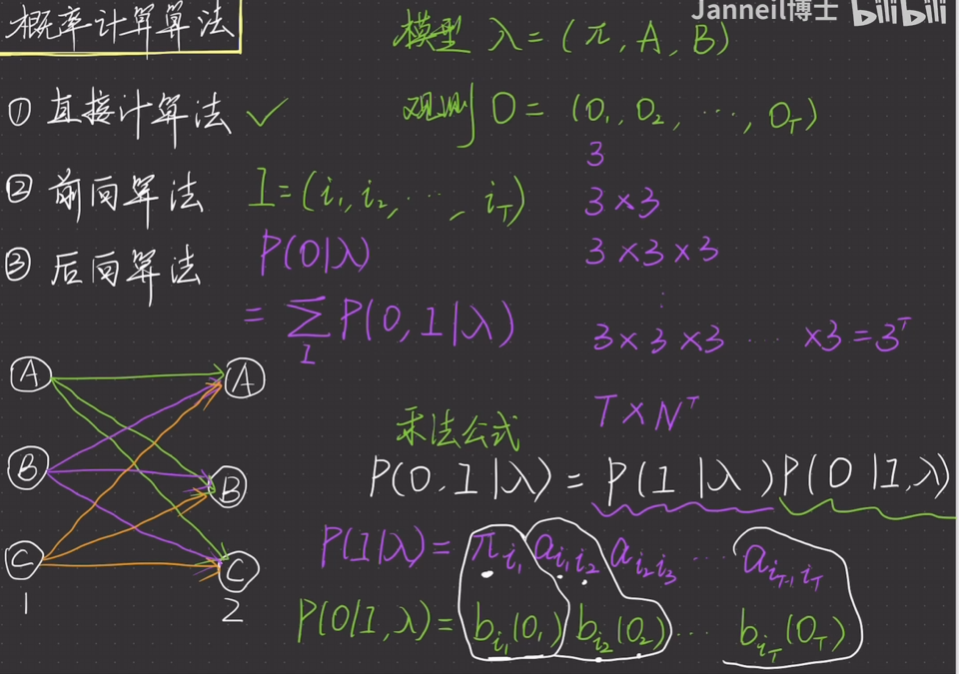{width=60%}
#### 前向算法
不同于直接计算法统计可能的方案数，前向算法计算的是到每个状态的概率。
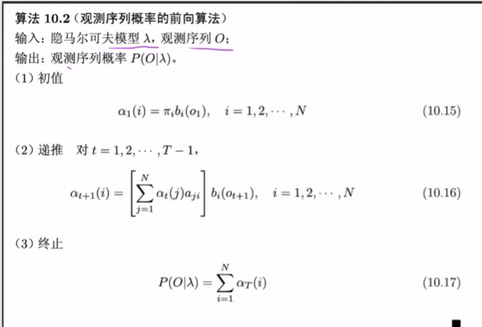{width=60%}

#### 后向算法  
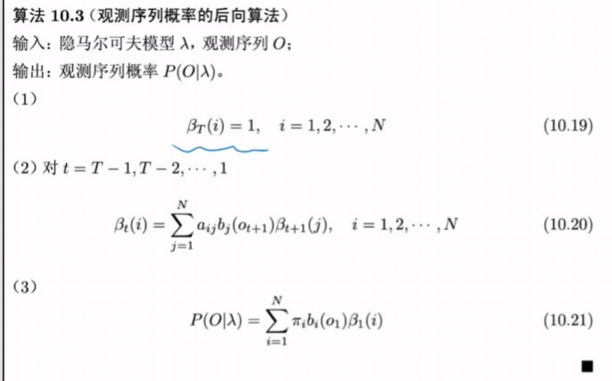{width=60%}

### Baum-Welch算法
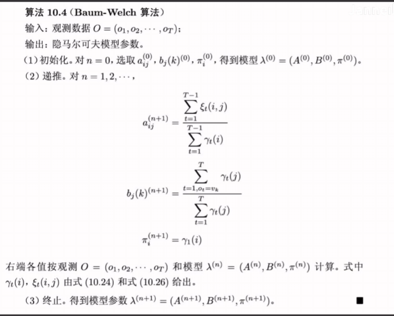{width=60%}
内容不全，懒得补了。
可以简单认为，这些估计是根据$\frac{从原状态转移到目标状态的样本数量}{原状态的样本数量}$得到的。

### 预测算法
#### 近似算法  
利用前向算法得出的结果和后向算法得出的结果一起进行计算。对于每个状态，将对应位置的前向结果和后向结果相乘即可得到概率，选择每个对应时刻下的最大值，即为预测结果。
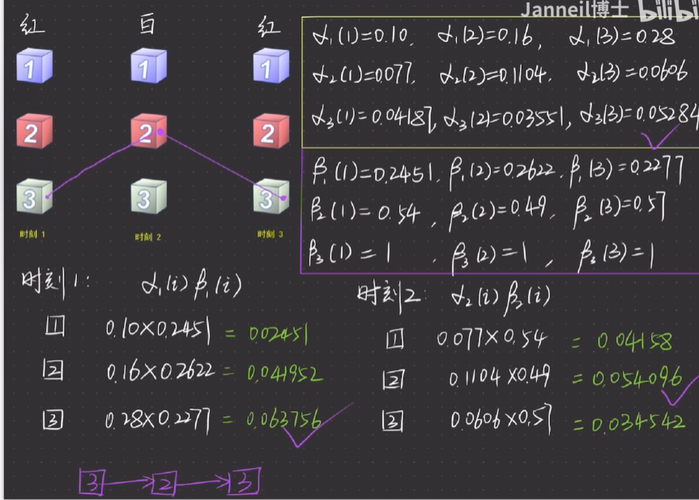{width=60%}
逐点地预测，没有关注全局信息。
#### 维特比算法
通过动态规划的思想进行预测。
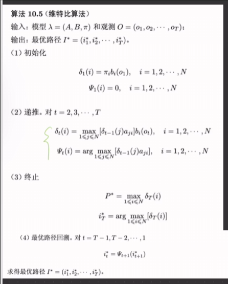{width=60%}
相当于在不断地向前计算概率的同时，保留到该节点的最佳路径，最终选择概率最大的作为终点节点。