## 条件随机场
### 概率无向图
#### 无向图 
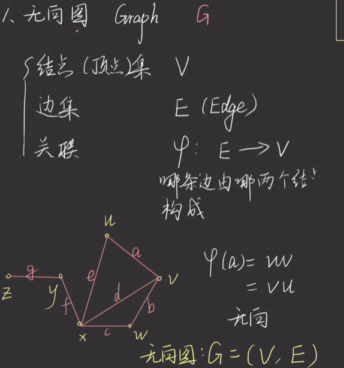{width=60%}
#### 马尔可夫性
- 成对马尔可夫性
    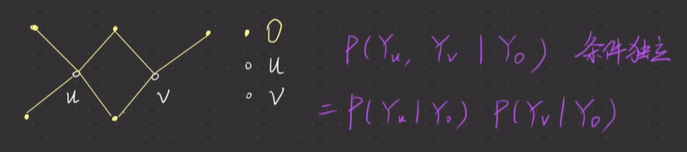{width=60%}
    两个节点没有直接相连，被其他节点隔开，那么就是条件独立的。
- 局部马尔可夫性
    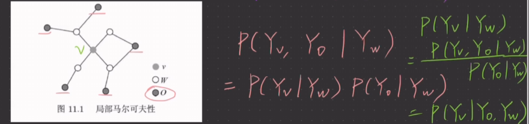{width=60%}
    一个节点与一组节点没有直接相连，则也具有条件独立性。
- 全局马尔可夫性
    {width=60%}
    一组节点与一组节点没有直接相连。则有条件独立性。

#### 具体定义
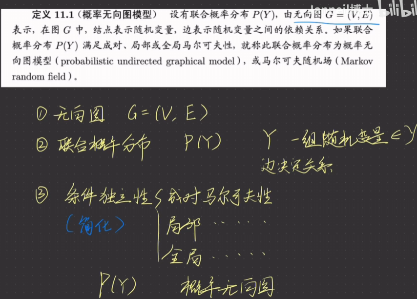{width=60%}

### 因子分解
#### 团的定义 
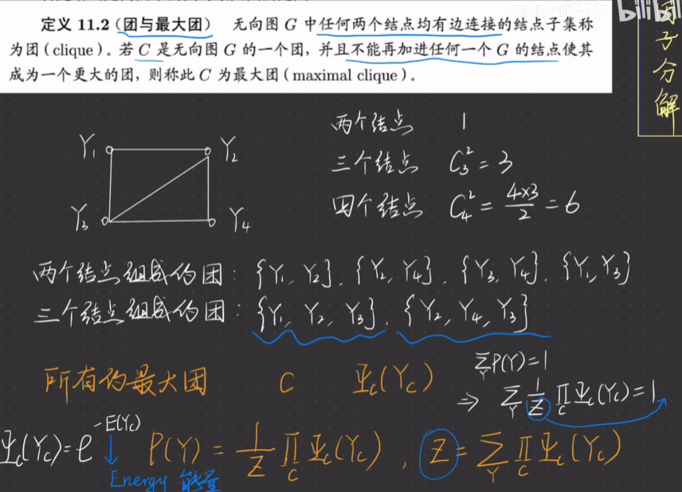{width=60%}

#### 最大熵模型
结合条件随机场理解最大熵模型
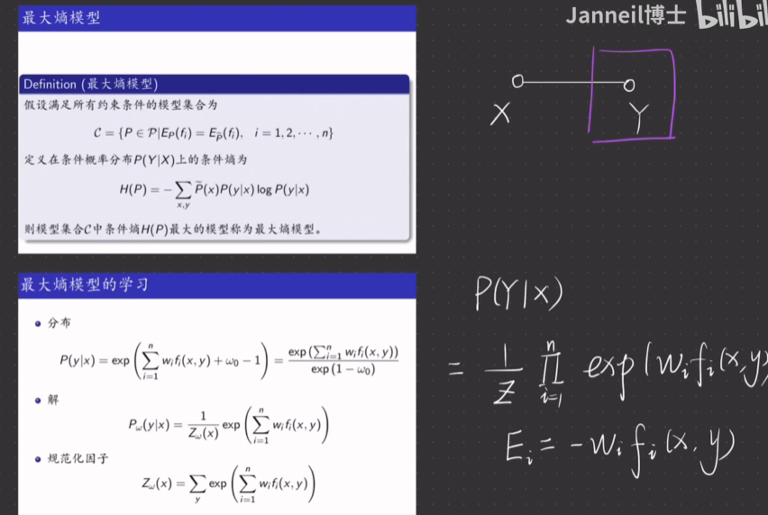{width=60%}

### 条件随机场的定义
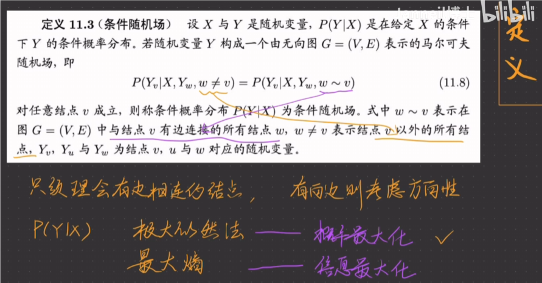{width=60%}
只需要找到所有与目标节点直接相连的节点即可，与所有除了目标节点作为条件算出来的概率一致。
#### 线性链条件随机场
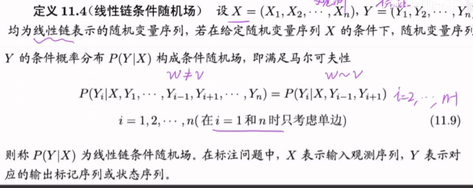{width=60%}

#### 条件随机场的参数化形式 

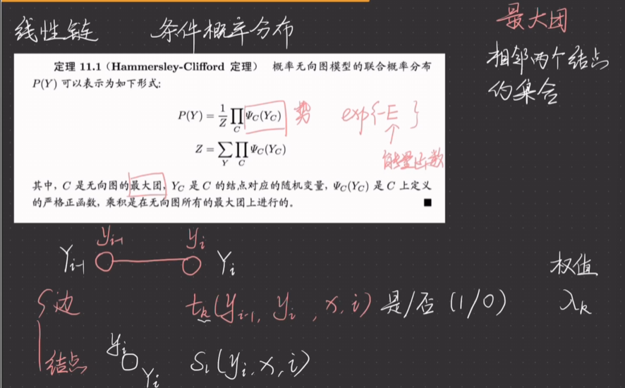{width=60%}
图中更侧重于针对于线性链的特化。
接下来是正式的定义：
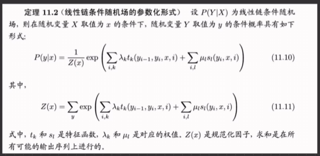{width=60%}

#### 条件随机场的简化形式 
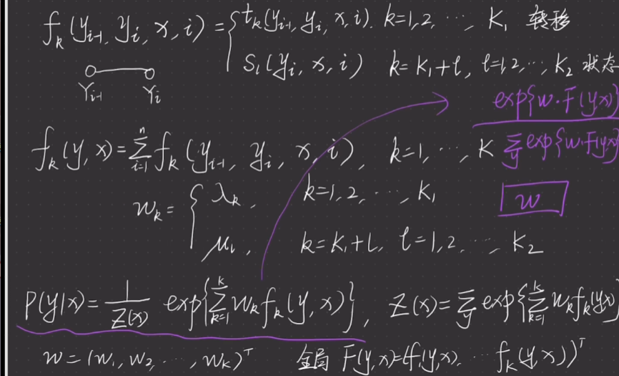{width=60%}
只是模样简化了。实际计算方法与时间是与原来一致的。

#### 条件随机场的矩阵形式
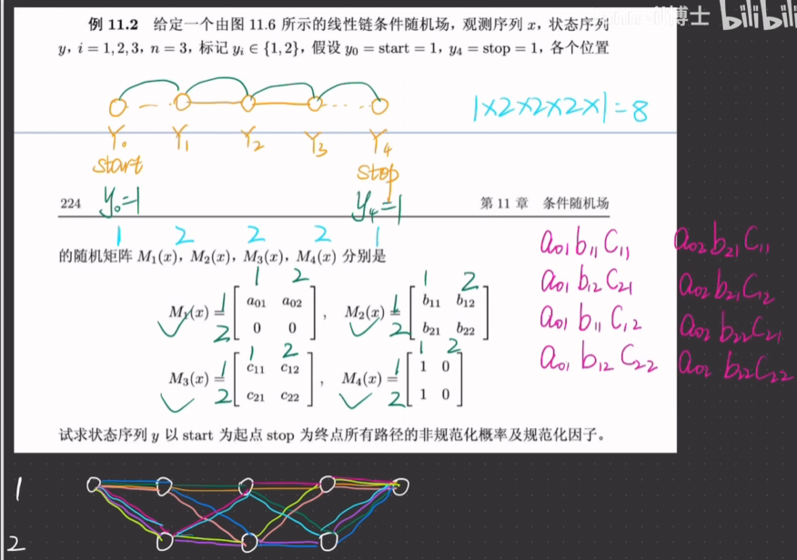{width=60%}
$M_i(x)$对应的行和列都是$y$的特征数量，即矩阵大小为$M \times M$。
最后计算方式也不是矩阵的乘法，而是根据矩阵来做转移而已。

### 概率计算问题 
#### 前向向量
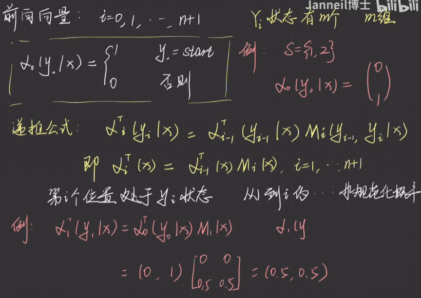{width=60%}
#### 后向向量
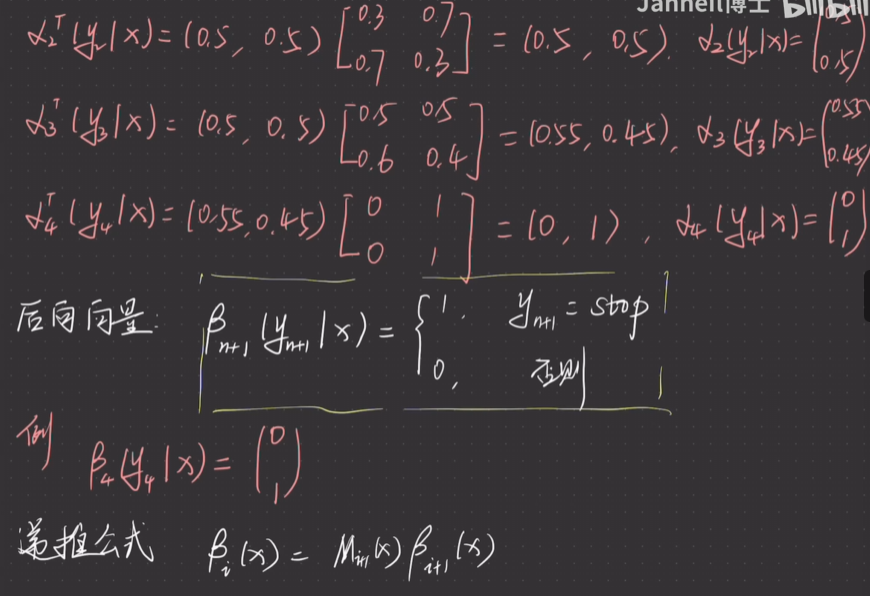{width=60%}
（上面的是前向向量的计算步骤，下面的是后向向量）
#### 计算结果 
经过上面的计算，我们可以得到：
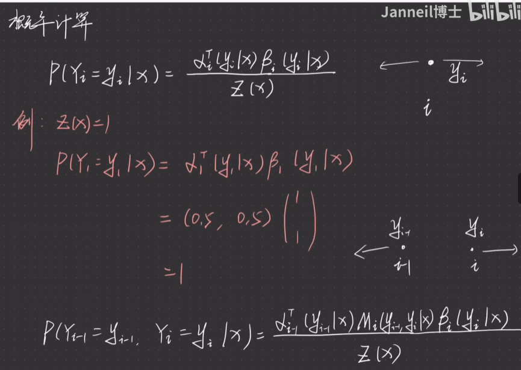{width=60%}
针对于概率计算，利用前向和后向向量相乘可以直接得到某一点的概率。如果想要得到某一组点的概率需要×对应的$M_i$矩阵。
针对于$Z(x)$的计算，也有多种方法：
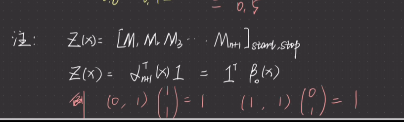{width=60%}

### 条件随机场的学习算法
#### 总览
我们的目标是优化模型参数$w_k$。
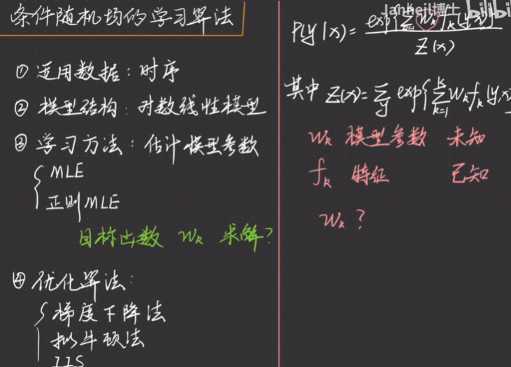{width=60%}

#### 最大似然函数
最终化简得到的最大似然函数为：
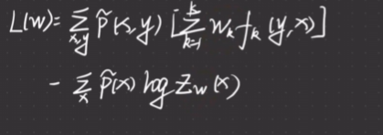{width=60%}

#### 优化算法 
##### 最速梯度下降法
前景提要
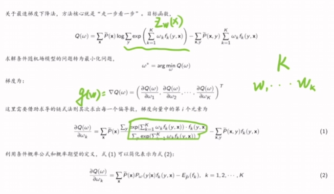{width=60%}
具体算法
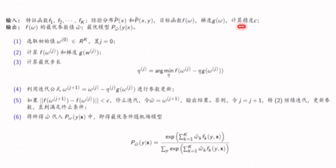{width=60%}

##### 改进的迭代尺度法 
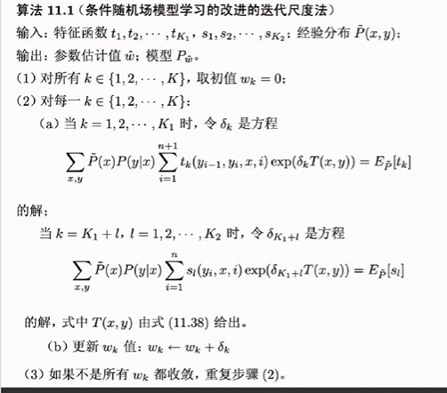{width=60%}

### 条件随机场预测  

#### 维特比算法  
基础的推理条件
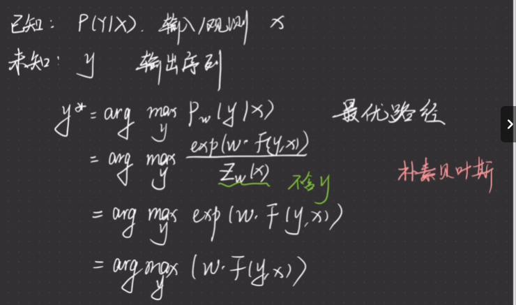{width=60%}
具体的算法：
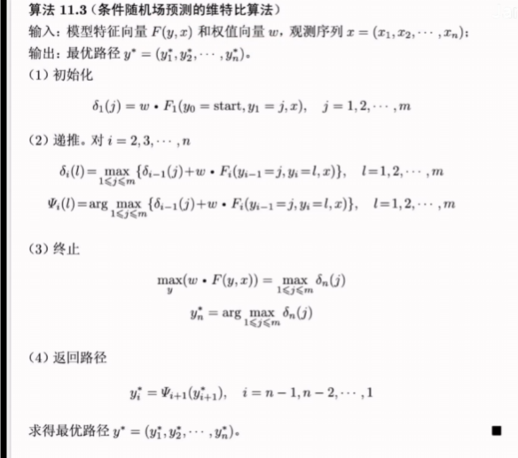{width=60%}
$w$是权值，$F()$是特征函数值，具体可以参考这个例子。
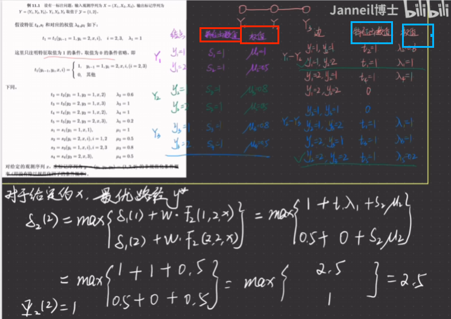{width=60%}